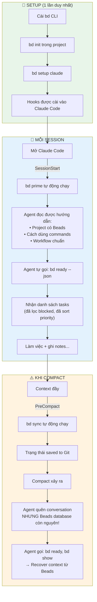
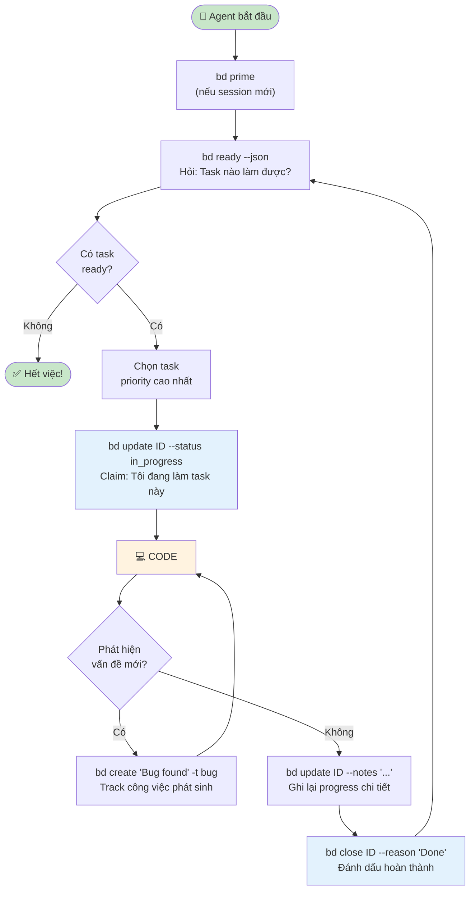

# Beads - Hiểu từ Gốc đến Ngọn

> **Dành cho Junior Developer muốn hiểu Agentic Coding**

---

## Phần 1: Hiểu Vấn Đề Trước Khi Hiểu Giải Pháp

### 1.1 AI Agent là gì?

Hãy tưởng tượng bạn thuê một **lập trình viên ảo** làm việc cho bạn. Bạn giao task, nó code. Đó là AI Coding Agent (Claude Code, Cursor, Aider...).

**Nhưng có một vấn đề lớn:**

```
Bạn: "Hãy build feature Authentication cho tôi"

AI Agent: "OK, tôi sẽ:
1. Tạo database schema
2. Viết Login API
3. Thêm JWT middleware
4. Tạo Logout endpoint"

[... Agent làm được bước 1, 2 ...]

[Context window đầy → Compact/Clear]

AI Agent: "Xin chào! Tôi có thể giúp gì cho bạn?"

Bạn: "??? Bạn đang làm Authentication cho tôi mà!"

AI Agent: "Tôi không nhớ... Bạn có thể nói lại không?"
```

**Đây gọi là "Agent Amnesia" - Mất trí nhớ của Agent.**

### 1.2 Tại sao Agent bị mất trí nhớ?

```
┌─────────────────────────────────────────────────────────┐
│                   CONTEXT WINDOW                         │
│                   (Bộ nhớ của AI)                        │
│                                                          │
│  ┌──────────────────────────────────────────────────┐   │
│  │ System prompt + Conversation + Code + Files...    │   │
│  │                                                    │   │
│  │ Giới hạn: ~100k-200k tokens                       │   │
│  └──────────────────────────────────────────────────┘   │
│                                                          │
│  Khi đầy → COMPACT (nén) hoặc CLEAR (xóa)               │
│  → Mất conversation history                              │
│  → Agent quên đang làm gì                                │
└─────────────────────────────────────────────────────────┘
```

**Vấn đề cốt lõi:**
- AI Agent chỉ "nhớ" những gì trong context window
- Context window có giới hạn
- Khi compact/clear → mất thông tin
- Session mới = Agent không biết gì về session cũ

### 1.3 "Nhưng đã có Markdown file rồi mà?" - Câu hỏi quan trọng

Nhiều người sẽ hỏi: **"Spec-driven development đã dùng Markdown file (tasks.md, TODO.md) để track tasks rồi. Tại sao vẫn cần Beads?"**

Đây là câu hỏi **RẤT HAY** và cần được giải thích kỹ.

---

## Phần 2: Tại Sao Markdown Không Đủ Cho AI Agent?

### 2.1 Cách tiếp cận Markdown (Spec-Driven)

```markdown
# tasks.md

## TODO
- [ ] Setup database
- [ ] Create Login API (depends on: Setup database)
- [ ] Add JWT middleware (depends on: Setup database)
- [ ] Logout endpoint (depends on: Login API, JWT middleware)

## IN PROGRESS
- [ ] ...

## DONE
- [x] ...
```

**Có vẻ ổn rồi mà?** Agent đọc file này, biết task, biết dependency. 

**Vậy tại sao vẫn "trượt context"?**

### 2.2 Vấn đề 1: Markdown là "Implicit" - Agent phải tự suy luận

```markdown
# tasks.md
- [ ] Login API (depends on: Setup database)
```

Agent đọc được text, nhưng phải **tự suy luận**:
- "depends on" nghĩa là gì? Block hoàn toàn? Hay chỉ liên quan?
- "Setup database" đã done chưa? Phải tìm trong file
- Task nào priority cao hơn? Không rõ ràng

```
Agent đọc file và suy luận:
"Hmm, Login API depends on Setup database...
 Để tôi tìm Setup database trong file...
 Tìm thấy ở section TODO, chưa có dấu [x]...
 Vậy chắc là chưa done...
 Vậy tôi không nên làm Login API..."
```

**Vấn đề:** 
- Suy luận = **Tốn tokens** (phải "nghĩ")
- Suy luận = **Có thể sai** (hiểu nhầm format)

### So sánh với Beads:

```bash
$ bd ready --json
[{"id":"bd-1","title":"Setup database","priority":1}]
```

**Explicit - Rõ ràng:** 
- Chỉ tasks ready mới trả về
- Agent **không cần suy luận**
- Hỏi → Nhận câu trả lời chính xác

---

### 2.3 Vấn đề 2: Markdown không có "Query" - Phải đọc toàn bộ file

```
┌─────────────────────────────────────────────────────────┐
│                   MARKDOWN APPROACH                      │
│                                                          │
│   tasks.md có 500 dòng                                  │
│   ┌──────────────────────────────────────────────────┐  │
│   │ # Epic 1                                          │  │
│   │ - [ ] Task 1.1                                    │  │
│   │ - [ ] Task 1.2 (depends on 1.1)                  │  │
│   │ - [x] Task 1.3                                    │  │
│   │ # Epic 2                                          │  │
│   │ - [ ] Task 2.1                                    │  │
│   │ ... (hàng trăm dòng nữa)                         │  │
│   └──────────────────────────────────────────────────┘  │
│                                                          │
│   Agent muốn biết "task nào làm được?"                  │
│                                                          │
│   Phải: LOAD TOÀN BỘ FILE vào context                   │
│         → 500 dòng ≈ 2000 tokens                        │
│         → Parse text, tìm pattern [ ] và [x]            │
│         → Phân tích "depends on"                        │
│         → Suy luận task nào ready                       │
│         → MỖI LẦN HỎI đều tốn như vậy!                 │
│                                                          │
└─────────────────────────────────────────────────────────┘
```

```
┌─────────────────────────────────────────────────────────┐
│                    BEADS APPROACH                        │
│                                                          │
│   Agent muốn biết "task nào làm được?"                  │
│                                                          │
│   $ bd ready --json                                     │
│   ┌──────────────────────────────────────────────────┐  │
│   │ [{"id":"bd-1","title":"Setup database","p":1}]   │  │
│   └──────────────────────────────────────────────────┘  │
│                                                          │
│   Agent nhận: CHỈ DATA CẦN THIẾT                        │
│               → 1 task ready ≈ 50 tokens                │
│               → Đã filter xong                          │
│               → Đã sort theo priority                   │
│               → Không cần suy luận gì thêm              │
│                                                          │
└─────────────────────────────────────────────────────────┘
```

**Vấn đề cốt lõi:** Markdown không scale. Project lớn = file lớn = tốn context mỗi lần đọc.

---

### 2.4 Vấn đề 3: Markdown không track "Trạng thái giữa chừng"

Đây là vấn đề **NGHIÊM TRỌNG NHẤT**!

**Markdown chỉ có 2 trạng thái:**
```markdown
- [ ] Task chưa làm (TODO)
- [x] Task đã xong (DONE)
```

**Không có:**
- "Đang làm được 50%"
- "Đang đợi review"
- "Bị block bởi task khác"
- "Ai đang làm task này"

**Hậu quả khi compact giữa chừng:**

```
Session đang chạy:
├── Agent đọc tasks.md
├── Agent thấy: - [ ] Setup database (chưa làm)
├── Agent BẮT ĐẦU làm Setup database
├── Agent làm được 50% (schema xong, đang tạo migrations)
│
└── COMPACT XẢY RA (giữa chừng!)
    │
    ▼
    Agent mất conversation
    Agent đọc lại tasks.md
    Agent thấy: - [ ] Setup database (vẫn chưa check!)
    
    Agent nghĩ: "Task này chưa làm. Để tôi bắt đầu..."
    
    → LÀM LẠI TỪ ĐẦU! 😱
    → Code cũ có thể bị overwrite!
```

### So sánh với Beads:

```bash
# TRƯỚC compact - Agent ghi lại progress
$ bd update bd-1 --status in_progress
$ bd update bd-1 --notes "
  COMPLETED: Database schema designed, tables created
  IN PROGRESS: Creating migration files
  NEXT: Run migrations on dev server
  FILES: src/db/schema.sql, migrations/001_init.sql
"

[COMPACT XẢY RA]

# SAU compact - Agent query lại
$ bd show bd-1

Status: in_progress  ← Biết đang làm dở!
Notes: "COMPLETED: schema... IN PROGRESS: migrations..."

Agent: "À, tôi đang tạo migration files. File schema.sql đã xong.
        Tiếp tục tạo migrations..."

→ TIẾP TỤC ĐÚNG CHỖ! ✅
```

---

### 2.5 Vấn đề 4: Markdown dễ conflict khi nhiều người/agent edit

```
Alice và Bob cùng edit tasks.md:

Alice's version:
- [x] Setup database        ← Alice đánh dấu done
- [ ] Login API

Bob's version (cùng lúc):
- [ ] Setup database
- [x] Login API             ← Bob đánh dấu done

Git merge:
<<<<<<< Alice
- [x] Setup database
- [ ] Login API
=======
- [ ] Setup database  
- [x] Login API
>>>>>>> Bob

→ CONFLICT! Phải resolve thủ công
```

### So sánh với Beads:

```bash
# Alice tạo task
$ bd create "Setup database"    # → bd-a1b2 (hash)

# Bob tạo task (cùng lúc)
$ bd create "Login API"         # → bd-c3d4 (hash khác)

# Git merge: Không conflict!
# Vì mỗi task là 1 dòng riêng trong JSONL
# Và ID là hash, không trùng nhau
```

---

### 2.6 Tổng hợp: Markdown vs Beads cho Task Management

| Khía cạnh | Markdown (tasks.md) | Beads |
|-----------|---------------------|-------|
| **Cách lấy "task cần làm"** | Đọc toàn file, tự parse, tự suy luận | `bd ready` → nhận đúng tasks |
| **Context cost** | Toàn file (có thể 2000+ tokens) | Chỉ data cần (~50-100 tokens) |
| **Dependency** | Text mô tả, agent tự hiểu | Database enforce, tự động block |
| **Trạng thái** | Chỉ TODO/DONE | open/in_progress/blocked/closed + notes |
| **Track progress giữa chừng** | ❌ Không có | ✅ Notes chi tiết |
| **Nhiều người/agent edit** | Dễ conflict | Hash ID, auto-merge |
| **Sau compact** | Đọc lại toàn file, có thể hiểu sai | Query chính xác trạng thái |

---

### 2.7 Ví dụ thực tế: Cùng một tình huống, 2 cách tiếp cận

#### Với Markdown:

```
Session đang chạy:
│
├── Agent đọc tasks.md (tốn 2000 tokens)
├── Agent parse: "Task 3 depends on Task 1, 2..."
├── Agent suy luận: "Task 1, 2 chưa done → làm Task 1 trước"
├── Agent làm Task 1 được 50%
│
└── COMPACT XẢY RA
    │
    ▼
    Agent đọc lại tasks.md (tốn 2000 tokens LẦN NỮA)
    Agent thấy: - [ ] Task 1 (chưa có dấu [x])
    
    Agent: "Task 1 chưa làm. Để tôi bắt đầu..."
    
    → LÀM LẠI TỪ ĐẦU!
    → Tốn 4000 tokens chỉ để đọc file 2 lần
    → Công sức 50% bị mất
```

#### Với Beads:

```
Session đang chạy:
│
├── Agent: bd ready --json (tốn 50 tokens)
├── Output: [{"id":"bd-1","status":"open"}]
├── Agent: bd update bd-1 --status in_progress
├── Agent làm được 50%
├── Agent: bd update bd-1 --notes "Done: schema. Doing: migrations"
│
└── COMPACT XẢY RA
    │
    ▼
    Agent: bd ready --json (tốn 50 tokens)
    Output: [] (trống - vì bd-1 đang in_progress, không phải "ready")
    
    Agent: "Hmm, không có task ready. Có task nào đang làm dở không?"
    Agent: bd list --status in_progress
    Output: [{"id":"bd-1","status":"in_progress"}]
    
    Agent: bd show bd-1 (tốn 100 tokens)
    Output: {status: "in_progress", notes: "Done: schema. Doing: migrations"}
    
    Agent: "À, tôi đang làm migrations cho bd-1. Tiếp tục..."
    
    → TIẾP TỤC ĐÚNG CHỖ!
    → Chỉ tốn ~200 tokens
    → Không mất công sức
```

---

### 2.8 Kết luận: Tư duy đúng về Task Management cho AI Agent

```
┌─────────────────────────────────────────────────────────┐
│                                                          │
│   MARKDOWN = "Danh sách task" để ĐỌC và TỰ HIỂU         │
│                                                          │
│   • Agent đọc toàn bộ file                              │
│   • Agent tự parse format                                │
│   • Agent tự suy luận dependency                        │
│   • Agent tự xác định task nào làm được                 │
│   • → Tốn tokens, có thể sai, không track giữa chừng   │
│                                                          │
├─────────────────────────────────────────────────────────┤
│                                                          │
│   BEADS = "Hệ thống quản trị task" để HỎI và NHẬN      │
│                                                          │
│   • Agent hỏi: "Task nào làm được?"                     │
│   • Beads trả lời: Đây là danh sách (đã filter, sort)  │
│   • Agent hỏi: "Task này trạng thái gì?"               │
│   • Beads trả lời: Đang in_progress, notes là...       │
│   • → Ít tokens, chính xác, track đầy đủ               │
│                                                          │
└─────────────────────────────────────────────────────────┘
```

**Một câu tóm tắt:**

> **Markdown là "danh sách task" để đọc và tự hiểu.**
> **Beads là "hệ thống quản trị task" để hỏi và nhận câu trả lời.**
>
> Với Markdown: Agent đọc danh sách → Tự suy luận "task nào làm được" → Có thể sai, tốn tokens
>
> Với Beads: Agent hỏi "task nào làm được?" → Nhận đúng task cần làm → Chính xác, tiết kiệm

---

## Phần 3: Beads - Hệ Thống Quản Trị Task Thông Minh

### 3.1 Beads là gì?

Beads = **Issue Tracker** (như Jira, Trello) nhưng được thiết kế **cho AI Agent**, không phải cho con người.

> *"bd is a lightweight, git-based issue tracker designed for AI coding agents."*
> 
> *"bd là một issue tracker nhẹ, dựa trên git, được thiết kế cho AI coding agents."*

### 3.2 Điểm hay của Beads so với Jira/Trello thông thường

| Tính năng | Jira/Trello | Beads | Tại sao quan trọng? |
|-----------|-------------|-------|---------------------|
| **Giao diện** | Web UI cho người | CLI + JSON cho Agent | Agent không dùng được UI |
| **Query** | Click chuột | `bd ready --json` | Agent cần output có cấu trúc |
| **Storage** | Cloud server | Local Git | Không cần internet, sync qua git |
| **ID** | Số tuần tự (PROJ-1, PROJ-2) | Hash (bd-a1b2) | Tránh conflict khi nhiều agent |

### 3.3 Những điểm hay trong quản trị task của Beads

#### ✅ **1. Hệ thống Priority rõ ràng**

```bash
-p 0  # P0 - Critical (khẩn cấp nhất, làm ngay)
-p 1  # P1 - High (quan trọng)
-p 2  # P2 - Medium (bình thường)
-p 3  # P3 - Low (có thể chờ)
-p 4  # P4 - Backlog (làm khi rảnh)
```

**Tại sao hay?** Agent tự biết task nào làm trước:
```bash
$ bd ready --json
# Output: Trả về tasks theo thứ tự P0 → P1 → P2...
# Agent tự động chọn P0 trước
```

#### ✅ **2. Dependency - Sắp xếp task theo thứ tự logic**

Đây là điểm **TUYỆT VỜI** của Beads!

```
Ví dụ: Build feature Authentication

Task A: Setup database        ──┐
                                ├──→ Task C: Login API (phải đợi A, B)
Task B: Config OAuth          ──┘           │
                                            ▼
                              Task D: Logout (phải đợi C)
```

```bash
# Tạo tasks
bd create "Setup database" -p 1        # → bd-1
bd create "Config OAuth" -p 1          # → bd-2
bd create "Login API" -p 1             # → bd-3
bd create "Logout endpoint" -p 2       # → bd-4

# Thiết lập dependency
bd dep add bd-3 bd-1   # Login depends on Database
bd dep add bd-3 bd-2   # Login depends on OAuth
bd dep add bd-4 bd-3   # Logout depends on Login

# Giờ hỏi: Task nào ready?
$ bd ready
# Output: bd-1 (Setup database), bd-2 (Config OAuth)
# ✅ bd-3, bd-4 bị BLOCK - không hiện trong ready list!
```

**Tại sao hay?**
- Agent **KHÔNG THỂ** làm sai thứ tự
- Chỉ tasks không bị block mới xuất hiện trong `bd ready`
- Khi bd-1 và bd-2 closed → bd-3 tự động thành ready

#### ✅ **3. Auto-Ready Detection**

```bash
# Agent chỉ cần hỏi 1 câu:
$ bd ready --json

# Beads tự động:
# - Lọc tasks đang open
# - Loại bỏ tasks bị blocked
# - Sắp xếp theo priority
# - Trả về danh sách "việc có thể làm ngay"
```

Agent không cần suy nghĩ phức tạp. Hỏi → Nhận việc → Làm.

#### ✅ **4. Rich Status - Không chỉ TODO/DONE**

```bash
# Các trạng thái trong Beads:
open         # Chưa bắt đầu
in_progress  # Đang làm
blocked      # Bị chặn bởi task khác
closed       # Hoàn thành

# Kèm theo notes chi tiết:
bd update bd-1 --status in_progress --notes "
COMPLETED: Schema design
IN PROGRESS: Writing migrations
NEXT: Run on dev server
"
```

#### ✅ **5. Discovered Work - Track công việc phát sinh**

Đang làm task A, phát hiện bug B? Beads track được:

```bash
# Đang làm bd-10 (Add Payment)
# Phát hiện bug CORS

$ bd create "CORS bug" -t bug -p 0
# → bd-11

$ bd dep add bd-11 bd-10 --type discovered-from
# Ghi nhận: "bd-11 được phát hiện khi làm bd-10"
```

**Tại sao hay?** 
- Không mất track công việc phát sinh
- Audit trail: biết bug từ đâu ra
- Agent sau này đọc được lịch sử

#### ✅ **6. Hash-based ID - Không conflict**

```
Jira: PROJ-1, PROJ-2, PROJ-3... (tuần tự)
      → 2 người tạo cùng lúc = CONFLICT!

Beads: bd-a1b2, bd-c3d4, bd-e5f6... (hash ngẫu nhiên)
       → 2 agent tạo cùng lúc = OK, ID khác nhau!
```

#### ✅ **7. Hierarchical Structure - Epic/Task**

```bash
# Tạo Epic (nhóm lớn)
bd create "Auth System" -t epic -p 1
# → bd-a3f8

# Tạo Sub-tasks (tự động có suffix)
bd create "Login UI" -p 1 --parent bd-a3f8      # → bd-a3f8.1
bd create "Backend API" -p 1 --parent bd-a3f8   # → bd-a3f8.2
bd create "Unit Tests" -p 2 --parent bd-a3f8    # → bd-a3f8.3

# Khi TẤT CẢ children closed → Epic tự động closed!
```

#### ✅ **8. Git-Native - Sync tự động**

```bash
# Làm việc ở máy A
bd create "Fix bug" -p 1
git add .beads/
git commit -m "Add task"
git push

# Máy B (hoặc Agent khác)
git pull
bd ready  # Tự động thấy task mới!
```

---

## Phần 4: Beads + AI Agent = Cách Vận Hành

### 4.1 Vấn đề: Agent không tự biết về Beads

AI Agent **không tự động biết** project đang dùng Beads. Nó cần được **"dạy"**.

```
❌ KHÔNG CÓ HƯỚNG DẪN:
Agent: "Xin chào! Tôi có thể giúp gì?"
(Không biết có Beads, không biết có tasks)

✅ CÓ HƯỚNG DẪN:
Agent: "Tôi thấy project này dùng Beads. 
        Để tôi check tasks: bd ready --json
        Có 3 tasks ready. Bắt đầu với bd-1..."
```

### 4.2 Giải pháp: Hooks - Tự động "nhắc" Agent

**Hook = Lệnh tự động chạy khi có sự kiện**

```
┌─────────────────────────────────────────────────────────┐
│                    CLAUDE CODE                           │
│                                                          │
│  Event: SessionStart (mở Claude Code)                   │
│         ↓                                                │
│  Hook chạy: bd prime                                    │
│         ↓                                                │
│  Output: ~1-2k tokens hướng dẫn workflow                │
│         ↓                                                │
│  Agent đọc được → Biết có Beads → Biết cách dùng        │
│                                                          │
│  Event: PreCompact (trước khi compact context)          │
│         ↓                                                │
│  Hook chạy: bd sync                                     │
│         ↓                                                │
│  Lưu trạng thái → Không mất data khi compact            │
└─────────────────────────────────────────────────────────┘
```

### 4.3 `bd prime` - "Bản hướng dẫn" cho Agent

Khi chạy `bd prime`, nó output một đoạn text như:

```markdown
# Beads Workflow Context

## Core Rules
- Track strategic work in beads (multi-session, dependencies)
- Use `bd create` for issues
- Use `bd ready` to find work

## Essential Commands
- `bd ready --json` - Xem tasks sẵn sàng
- `bd update <id> --status in_progress` - Claim task
- `bd close <id> --reason "Done"` - Hoàn thành task

## Session Close Protocol
1. Commit code
2. Update beads notes
3. bd sync
4. git push
```

**Mục đích của `bd prime`:**
1. **Nhắc Agent:** "Có hệ thống Beads trong project này"
2. **Dạy Agent:** "Đây là các lệnh cơ bản"
3. **Hướng dẫn Agent:** "Khi làm task, hãy query Beads trước"

### 4.4 Tổng kết flow vận hành



---

## Phần 5: Workflow Chi Tiết cho Junior Dev

### 5.1 Vai trò của Con người vs Agent

```
┌─────────────────────────────────────────────────────────┐
│                      CON NGƯỜI                           │
│                    (Chiến lược)                          │
│                                                          │
│  • Lên plan: "Cần build Authentication"                 │
│  • Tạo Epic: bd create "Auth System" -t epic            │
│  • Tạo Tasks: bd create "Login API" -p 1                │
│  • Set Dependencies: bd dep add ...                     │
│  • Review kết quả                                        │
└─────────────────────────────────────────────────────────┘
                          ↓
┌─────────────────────────────────────────────────────────┐
│                      AI AGENT                            │
│                    (Chiến thuật)                         │
│                                                          │
│  • Query tasks: bd ready --json                         │
│  • Claim task: bd update <id> --status in_progress     │
│  • Code, code, code...                                  │
│  • Ghi notes: bd update <id> --notes "..."             │
│  • Close task: bd close <id> --reason "Done"           │
│  • Lặp lại cho đến khi hết tasks...                    │
└─────────────────────────────────────────────────────────┘
```

### 5.2 Agent Workflow Loop



### 5.3 Ví dụ cụ thể từng bước

**Bước 1: Human tạo tasks**
```bash
# Tạo Epic
$ bd create "User Authentication" -t epic -p 1
Created: bd-auth

# Tạo sub-tasks
$ bd create "Setup OAuth" -p 1 --parent bd-auth
Created: bd-auth.1

$ bd create "Login API" -p 1 --parent bd-auth
Created: bd-auth.2

$ bd create "JWT Middleware" -p 1 --parent bd-auth
Created: bd-auth.3

# Set dependencies
$ bd dep add bd-auth.2 bd-auth.1   # Login needs OAuth
$ bd dep add bd-auth.3 bd-auth.1   # JWT needs OAuth
```

**Bước 2: Agent query và làm việc**
```bash
# Agent hỏi: "Task nào làm được?"
Agent: $ bd ready --json
Output: [{"id":"bd-auth.1","title":"Setup OAuth","priority":1}]

# Chỉ có bd-auth.1 ready! (bd-auth.2, bd-auth.3 bị block)

Agent: "Tôi sẽ làm bd-auth.1 - Setup OAuth"

Agent: $ bd update bd-auth.1 --status in_progress

# ... Agent code OAuth integration ...

Agent: $ bd update bd-auth.1 --notes "
COMPLETED: Google OAuth integrated
NEXT: Test callback URLs
"

Agent: $ bd close bd-auth.1 --reason "OAuth setup complete"
```

**Bước 3: Dependency tự động unblock**
```bash
# Agent hỏi lại
Agent: $ bd ready --json
Output: [
  {"id":"bd-auth.2","title":"Login API","priority":1},
  {"id":"bd-auth.3","title":"JWT Middleware","priority":1}
]

# 2 tasks được unblock! (vì bd-auth.1 đã closed)

Agent: "bd-auth.2 và bd-auth.3 cùng priority. Làm bd-auth.2 trước..."
```

---

## Phần 6: Xử Lý Sau Compact

### 6.1 Điểm yếu cần biết

```
Timeline:
──────────────────────────────────────────────────────────►
│                    │                    │
▼                    ▼                    ▼
Session Start        Auto-Compact         Sau Compact
bd prime chạy ✅     bd sync chạy ✅      bd prime KHÔNG chạy ❌
Agent biết Beads     Data saved           Agent quên conversation
                                          NHƯNG Beads còn nguyên
```

**Vấn đề:** Sau compact, `bd prime` KHÔNG tự chạy lại. Agent cần tự query.

### 6.2 Giải pháp: Notes là "Thư gửi Agent tương lai"

> *"Write notes as if explaining to a future agent with zero conversation context."*
>
> *"Viết notes như thể giải thích cho agent tương lai không có context nào."*

```bash
# ❌ BAD - Notes vô nghĩa cho agent sau compact
bd update bd-1 --notes "Done"

# ✅ GOOD - Notes đầy đủ context
bd update bd-1 --notes "
COMPLETED: OAuth integration với Google provider
IN PROGRESS: Testing callback URLs
NEXT: Add GitHub OAuth provider
FILES CHANGED: src/auth/oauth.ts, config/providers.json
KEY DECISION: Dùng PKCE flow vì secure hơn
BLOCKERS: None
"
```

### 6.3 Hướng dẫn Agent trong CLAUDE.md

Thêm vào file `CLAUDE.md` của project:

```markdown
## ⚠️ Sau khi compact hoặc không nhớ context

Nếu không nhớ đang làm gì, LẬP TỨC chạy:
1. `bd ready --json` - Xem tasks sẵn sàng
2. `bd show <id>` - Xem chi tiết task (đọc notes!)

KHÔNG ĐƯỢC ĐOÁN. PHẢI query Beads trước.
```

---

## Phần 7: Cài Đặt Nhanh

```bash
# 1. Cài CLI
curl -fsSL https://raw.githubusercontent.com/steveyegge/beads/main/scripts/install.sh | bash

# 2. Khởi tạo trong project (⚠️ NHỚ ĐẶT PREFIX NGẮN!)
cd your-project
bd init --prefix myapp    # ← Quan trọng! Xem Phần 8

# 3. Setup hooks cho Claude Code
bd setup claude

# 4. Kiểm tra
bd doctor
```

**Xong!** Giờ mỗi khi mở Claude Code:
- `bd prime` tự chạy → Agent biết về Beads
- Agent sẽ tự `bd ready` → Nhận tasks
- Trước compact → `bd sync` tự chạy → Data saved

---

## Phần 8: ⚠️ ID Format và Prefix - Rất Quan Trọng!

### 8.1 Vấn đề ID xấu mà người mới thường gặp

Khi bạn chạy `bd init` mà **KHÔNG đặt prefix**, Beads có thể tạo ID rất dài và xấu:

```
❌ ID XẤU (không đặt prefix):
Competitor-Video-Analysis-System-ey3
My-Super-Long-Project-Name-abc123

✅ ID ĐẸP (có đặt prefix ngắn):
cvs-ey3
myapp-a1b2
auth-c3d4
```

### 8.2 Cấu trúc ID trong Beads

```
<prefix>-<hash>

Ví dụ:
┌────────┬───────┐
│ prefix │ hash  │
├────────┼───────┤
│ bd     │ a1b2  │  → bd-a1b2
│ myapp  │ c3d4  │  → myapp-c3d4
│ auth   │ e5f6  │  → auth-e5f6
└────────┴───────┘

Với Epic và Sub-tasks:
┌────────┬───────┬─────────┐
│ prefix │ hash  │ suffix  │
├────────┼───────┼─────────┤
│ auth   │ a3f8  │         │  → auth-a3f8 (Epic)
│ auth   │ a3f8  │ .1      │  → auth-a3f8.1 (Sub-task 1)
│ auth   │ a3f8  │ .2      │  → auth-a3f8.2 (Sub-task 2)
└────────┴───────┴─────────┘
```

### 8.3 Cách đặt Prefix đúng

#### Khi khởi tạo project MỚI:

```bash
# ✅ ĐÚNG - Đặt prefix ngắn gọn
bd init --prefix myapp
bd init --prefix cvs
bd init --prefix auth

# ❌ SAI - Không đặt prefix (hoặc prefix quá dài)
bd init
bd init --prefix my-super-long-project-name
```

#### Khi đã có database với prefix xấu:

Dùng lệnh `bd rename-prefix` để đổi:

```bash
# Bước 1: Xem prefix hiện tại
$ bd where
# Output: prefix: Competitor-Video-Analysis-System

# Bước 2: Preview đổi prefix (không thay đổi gì, chỉ xem trước)
$ bd rename-prefix cvs- --dry-run

# Output:
# Would rename 5 issues:
#   Competitor-Video-Analysis-System-ey3 → cvs-ey3
#   Competitor-Video-Analysis-System-f4g → cvs-f4g
#   ...

# Bước 3: Áp dụng đổi prefix
$ bd rename-prefix cvs-

# Bước 4: Verify
$ bd list
# Giờ thấy: cvs-ey3, cvs-f4g, ...
```

### 8.4 Khuyến nghị đặt tên Prefix

| Project | Prefix gợi ý | Ví dụ ID |
|---------|-------------|----------|
| Competitor Video System | `cvs-` | cvs-a1b2 |
| E-commerce App | `shop-` | shop-c3d4 |
| Authentication Service | `auth-` | auth-e5f6 |
| Mobile App | `app-` | app-g7h8 |
| API Backend | `api-` | api-i9j0 |

**Quy tắc:**
- **Ngắn:** 2-5 ký tự
- **Có nghĩa:** Dễ nhận ra project
- **Lowercase:** Dễ đọc, dễ gõ
- **Có dấu gạch ngang cuối:** `myapp-` (không bắt buộc nhưng clear hơn)

### 8.5 Các lệnh liên quan đến ID/Prefix

| Command | Mô tả |
|---------|-------|
| `bd init --prefix <name>` | Đặt prefix khi khởi tạo |
| `bd rename-prefix <new>` | Đổi prefix cho TẤT CẢ issues |
| `bd rename-prefix <new> --dry-run` | Preview đổi prefix (không thay đổi) |
| `bd where` | Xem database path và prefix hiện tại |
| `bd where --json` | Output JSON chi tiết |

### 8.6 Lưu ý quan trọng

```
⚠️ QUAN TRỌNG:

1. ĐẶT PREFIX NGAY KHI INIT
   → Tránh phải rename sau này
   
2. NẾU QUÊN ĐẶT PREFIX
   → Dùng bd rename-prefix để sửa
   → Lệnh này update TẤT CẢ issues trong database
   
3. SYNC SAU KHI RENAME
   → Chạy bd sync sau khi rename
   → Commit .beads/issues.jsonl vào git
```

---

## Phần 9: Cheat Sheet

### Human (Planning)
```bash
bd init --prefix <short-name>                       # Khởi tạo với prefix ngắn
bd create "Title" -t task|feature|bug|epic -p 0-4  # Tạo task
bd dep add <child> <parent>                         # Set dependency
bd list                                             # Xem tất cả
bd dep tree <id>                                    # Xem dependency tree
bd rename-prefix <new> --dry-run                    # Preview đổi prefix
bd rename-prefix <new>                              # Đổi prefix
```

### Agent (Execution)
```bash
bd ready --json                                    # Task nào làm được?
bd show <id>                                       # Chi tiết + notes
bd update <id> --status in_progress               # Claim task
bd update <id> --notes "..."                       # Ghi progress
bd close <id> --reason "Done"                      # Hoàn thành
```

### Maintenance
```bash
bd sync                # Sync với Git
bd doctor              # Kiểm tra health
bd prime               # Xem workflow guide
bd where               # Xem prefix và database path
```

---

## Phần 10: 🖥️ Beads UI - Giao Diện Trực Quan cho Beads

### 10.1 Vấn đề: CLI khó theo dõi với người mới

Beads là CLI-first, rất phù hợp cho AI Agent, nhưng với **con người** thì:

```
❌ Khó hình dung tổng quan tasks
❌ Không thấy được Board view như Trello/Jira
❌ Phải gõ lệnh liên tục để check status
```

### 10.2 Giải pháp: Beads UI

**Beads UI** là giao diện web local cho Beads, được tạo bởi cộng đồng.

> *"Local UI for Beads — Collaborate on issues with your coding agent."*

**GitHub:** https://github.com/mantoni/beads-ui

### 10.3 Tính năng chính

| Tính năng | Mô tả |
|-----------|-------|
| ✨ **Zero setup** | Chỉ cần `bdui start` |
| 📺 **Live updates** | Tự động cập nhật khi database thay đổi |
| 🔎 **Issues view** | Filter, search, edit inline |
| ⛰️ **Epics view** | Xem progress theo Epic, expand rows |
| 🏂 **Board view** | Kanban board: Blocked / Ready / In Progress / Closed |
| ⌨️ **Keyboard navigation** | Điều hướng không cần chuột |

### 10.4 Cài đặt và sử dụng

```bash
# Cài đặt global
npm i beads-ui -g

# Chạy trong project có Beads
cd your-project
bdui start --open    # Tự mở browser
```

**Lưu ý:** Project phải đã có `.beads/` (đã chạy `bd init`).

### 10.5 Các View trong Beads UI

#### 📋 Issues View
Xem danh sách tất cả issues, filter theo status, priority, search theo title.

```
┌─────────────────────────────────────────────────────────┐
│  🔎 Search...                    [Status ▼] [Priority ▼]│
├─────────────────────────────────────────────────────────┤
│  ID       │ Title              │ Status    │ Priority  │
├───────────┼────────────────────┼───────────┼───────────┤
│  bd-a1b2  │ Setup database     │ ✅ closed │ P1        │
│  bd-c3d4  │ Login API          │ 🔄 prog   │ P1        │
│  bd-e5f6  │ JWT Middleware     │ 🟡 ready  │ P1        │
│  bd-g7h8  │ Logout endpoint    │ 🔴 blocked│ P2        │
└─────────────────────────────────────────────────────────┘
```

#### ⛰️ Epics View
Xem progress của từng Epic, expand để thấy sub-tasks.

```
┌─────────────────────────────────────────────────────────┐
│  Epic                          │ Progress              │
├────────────────────────────────┼───────────────────────┤
│  ▶ bd-auth: Auth System        │ ████████░░ 75% (3/4)  │
│    ├── bd-auth.1: Setup OAuth  │ ✅ closed             │
│    ├── bd-auth.2: Login API    │ 🔄 in_progress        │
│    ├── bd-auth.3: JWT          │ 🟡 ready              │
│    └── bd-auth.4: Logout       │ 🔴 blocked            │
├────────────────────────────────┼───────────────────────┤
│  ▶ bd-pay: Payment System      │ ██░░░░░░░░ 20% (1/5)  │
└─────────────────────────────────────────────────────────┘
```

#### 🏂 Board View (Kanban)
Giống Trello - kéo thả tasks giữa các cột.

```
┌─────────────┬─────────────┬─────────────┬─────────────┐
│   BLOCKED   │    READY    │ IN PROGRESS │   CLOSED    │
├─────────────┼─────────────┼─────────────┼─────────────┤
│             │             │             │             │
│ ┌─────────┐ │ ┌─────────┐ │ ┌─────────┐ │ ┌─────────┐ │
│ │ Logout  │ │ │ JWT     │ │ │ Login   │ │ │ OAuth   │ │
│ │ bd-g7h8 │ │ │ bd-e5f6 │ │ │ bd-c3d4 │ │ │ bd-a1b2 │ │
│ │ P2      │ │ │ P1      │ │ │ P1      │ │ │ P1      │ │
│ └─────────┘ │ └─────────┘ │ └─────────┘ │ └─────────┘ │
│             │             │             │             │
└─────────────┴─────────────┴─────────────┴─────────────┘
```

### 10.6 Workflow kết hợp CLI + UI

```
┌─────────────────────────────────────────────────────────┐
│                     CON NGƯỜI                            │
│                                                          │
│  Dùng Beads UI để:                                      │
│  • Xem tổng quan (Board view)                           │
│  • Track progress (Epics view)                          │
│  • Quick edit inline                                    │
│                                                          │
└─────────────────────────────────────────────────────────┘
                          ↕ (sync qua database)
┌─────────────────────────────────────────────────────────┐
│                     AI AGENT                             │
│                                                          │
│  Dùng CLI để:                                           │
│  • bd ready --json                                      │
│  • bd update --status                                   │
│  • bd close --reason                                    │
│                                                          │
└─────────────────────────────────────────────────────────┘
```

**Live sync:** Khi Agent update task qua CLI → Beads UI tự động refresh!

### 10.7 Các lệnh Beads UI

```bash
bdui start              # Start server (default port 3000)
bdui start --open       # Start và mở browser
bdui start --port 8080  # Dùng port khác
bdui stop               # Stop server
bdui --help             # Xem tất cả options
```

### 10.8 Khi nào dùng UI vs CLI?

| Tình huống | Dùng |
|------------|------|
| Xem tổng quan project | 🖥️ **UI** - Board/Epics view |
| Tạo/edit nhiều tasks nhanh | 🖥️ **UI** - Inline edit |
| AI Agent làm việc | ⌨️ **CLI** - `bd ready`, `bd update` |
| Scripting/Automation | ⌨️ **CLI** - `--json` output |
| Demo cho team | 🖥️ **UI** - Trực quan hơn |

---

## Tóm Tắt Cuối

```
┌─────────────────────────────────────────────────────────┐
│                    BEADS LÀ GÌ?                          │
│                                                          │
│  Hệ thống quản trị task (như Jira) cho AI Agent         │
│                                                          │
├─────────────────────────────────────────────────────────┤
│                    GIẢI QUYẾT GÌ?                        │
│                                                          │
│  Agent Amnesia: AI quên khi compact context             │
│  → Beads = Bộ nhớ ngoài, persist trong Git              │
│                                                          │
├─────────────────────────────────────────────────────────┤
│              TẠI SAO KHÔNG DÙNG MARKDOWN?                │
│                                                          │
│  Markdown: Đọc toàn file → Suy luận → Có thể sai       │
│  Beads: Hỏi "task nào làm được?" → Nhận đúng task      │
│                                                          │
├─────────────────────────────────────────────────────────┤
│                    ĐIỂM HAY?                             │
│                                                          │
│  ✅ Priority: P0→P4, Agent biết làm gì trước            │
│  ✅ Dependency: Task bị block tự động                   │
│  ✅ Auto-ready: Hỏi 1 câu, nhận đúng tasks             │
│  ✅ Rich status: in_progress + notes chi tiết          │
│  ✅ Git-native: Sync tự động, team collaboration       │
│                                                          │
├─────────────────────────────────────────────────────────┤
│                    CÁCH VẬN HÀNH?                        │
│                                                          │
│  1. bd init --prefix <short> ← Đặt prefix ngắn!        │
│  2. bd prime (hook) → Nhắc Agent có Beads               │
│  3. Agent hỏi bd ready → Nhận tasks đã filter/sort     │
│  4. Agent làm việc, ghi notes vào Beads                │
│  5. bd sync (hook) → Save trước compact                 │
│  6. Sau compact: Query Beads → Context recovered        │
│                                                          │
├─────────────────────────────────────────────────────────┤
│              ⚠️ LƯU Ý QUAN TRỌNG CHO NGƯỜI MỚI          │
│                                                          │
│  • LUÔN đặt --prefix ngắn khi bd init                  │
│  • Nếu prefix xấu: bd rename-prefix <new>              │
│  • Prefix nên: 2-5 ký tự, lowercase, có nghĩa          │
│                                                          │
└─────────────────────────────────────────────────────────┘
```

---

## Resources

- **GitHub (Beads)**: https://github.com/steveyegge/beads
- **GitHub (Beads UI)**: https://github.com/mantoni/beads-ui
- **FAQ**: https://github.com/steveyegge/beads/blob/main/docs/FAQ.md
- **QUICKSTART**: https://github.com/steveyegge/beads/blob/main/docs/QUICKSTART.md
- **ADVANCED (rename-prefix)**: https://github.com/steveyegge/beads/blob/main/docs/ADVANCED.md

---

*Tài liệu này dành cho Junior Developer muốn hiểu Agentic Coding.*
*Được viết dựa trên tài liệu chính thức từ GitHub steveyegge/beads.*
