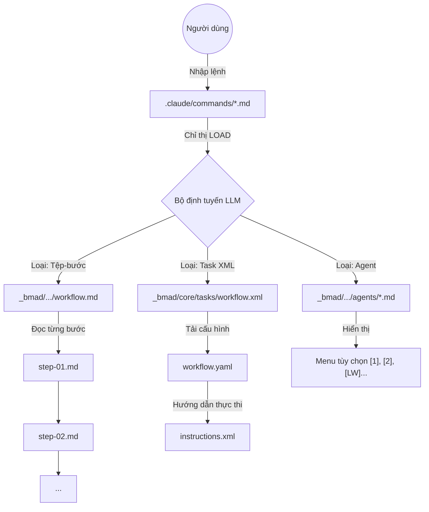
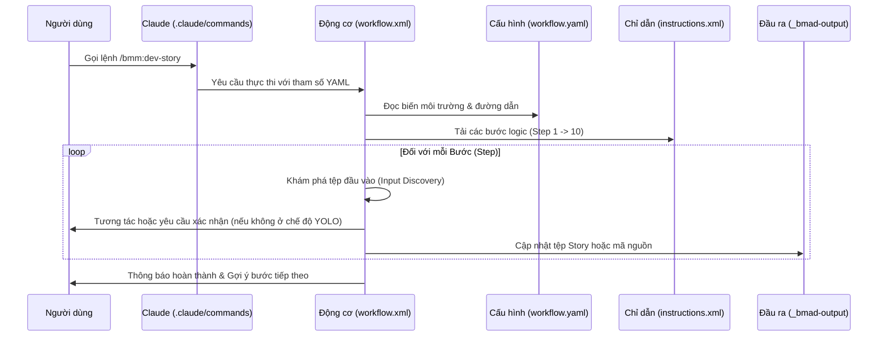
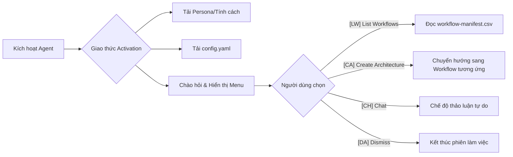

# Phân tích Kiến trúc BMAD-trong-Claude-Code

> Phân tích kỹ thuật đảo ngược (Reverse-engineered) về kiến trúc câu lệnh của BMAD v6.0.0-alpha.22 trong Claude Code

---

## A) Kiến trúc BMAD-trong-Claude-Code (Phần mô tả)

### Tổng quan

BMAD (Business Methodology and Architecture Development) v6.0.0-alpha.22 là một **khung điều phối agent dựa trên prompt và có tính mô-đun** được thiết kế riêng cho Claude Code. Hệ thống này triển khai phương pháp "vibe coding" thông qua một kiến trúc phân tầng tinh vi, trong đó:

1. **Câu lệnh (.claude/commands/)**: Đóng vai trò là các điểm truy cập mỏng (thin entry points) để chuyển hướng đến các prompt tiềm ẩn bên dưới.
2. **Agent (_bmad/*/agents/)**: Là các tệp prompt dựa trên nhân vật (persona) với các giao thức kích hoạt được nhúng bằng XML.
3. **Quy trình làm việc (Workflows - _bmad/*/workflows/)**: Là các công thức thực thi nhiều bước dưới định dạng YAML/Markdown.
4. **Nhiệm vụ (Tasks - _bmad/core/tasks/)**: Là các công cụ thực thi XML có thể tái sử dụng (quan trọng nhất là `workflow.xml`).
5. **Bản kê (Manifests - _bmad/_config/)**: Đóng vai trò là sổ đăng ký để khám phá và điều hướng (routing).

**Mô hình điều phối (Dispatch Model)**: BMAD sử dụng kiến trúc **dựa trên cấu hình, tải khi cần thiết (load-on-demand)**. Không có mã điều phối tập trung—thay vào đó, mỗi tệp lệnh chứa các hướng dẫn nội dòng (inline) yêu cầu Claude tải và thực thi các tệp agent/workflow cụ thể. "Bộ định tuyến" (router) thực tế chính là bản thân LLM, tuân theo các chỉ dẫn XML/Markdown được nhúng.

**Mẫu thiết kế chính**: Các câu lệnh là **vỏ bọc gián tiếp (indirection wrappers)**—chúng không chứa logic, chỉ chứa đường dẫn. Tất cả logic nằm trong các tệp workflow/agent mà chúng tham chiếu.

### Cấu trúc thư mục

```
_bmad/
├── _config/                          # Cấu hình chính & các tệp bản kê (manifest)
│   ├── manifest.yaml                 # Bản kê cài đặt (phiên bản 6.0.0-alpha.22)
│   ├── agent-manifest.csv            # Danh mục tất cả các agent (tổng cộng 16)
│   ├── workflow-manifest.csv         # Danh mục tất cả các quy trình (tổng cộng 39)
│   ├── task-manifest.csv             # Danh mục tất cả các nhiệm vụ (tổng cộng 6)
│   ├── agents/                       # Các tệp tùy chỉnh agent (YAML)
│   └── ides/                         # Cấu hình riêng cho IDE (claude-code.yaml)
│
├── _memory/                          # Bộ nhớ lâu dài cho các agent
│
├── core/                             # Mô-đun nền tảng cốt lõi của BMAD
│   ├── config.yaml                   # Cấu hình mô-đun cốt lõi
│   ├── agents/
│   │   └── bmad-master.md            # Agent điều phối chính (Master orchestrator)
│   ├── workflows/
│   │   ├── brainstorming/
│   │   ├── party-mode/               # Thảo luận đa agent
│   │   └── advanced-elicitation/
│   └── tasks/                        # Các nhiệm vụ nền tảng (dựa trên XML)
│       ├── workflow.xml              # ĐỘNG CƠ THỰC THI CỐT LÕI
│       ├── validate-workflow.xml
│       ├── index-docs.xml
│       └── shard-doc.xml
│
├── bmm/                              # Mô-đun Phương pháp Kinh doanh (Business Methodology Module)
│   ├── config.yaml
│   ├── agents/                       # 9 agent vai trò chuyên nghiệp
│   ├── workflows/
│   │   ├── 1-analysis/
│   │   ├── 2-plan-workflows/
│   │   ├── 3-solutioning/
│   │   ├── 4-implementation/
│   │   ├── bmad-quick-flow/
│   │   ├── testarch/
│   │   └── excalidraw-diagrams/
│   └── testarch/knowledge/           # Hơn 30 hướng dẫn liên quan đến kiểm thử
│
└── cis/                              # Bộ Sáng tạo Đổi mới (Creative Innovation Suite)
    ├── agents/                       # 6 agent sáng tạo/chiến lược
    └── workflows/
```

### Các mô-đun đã cài đặt

| Mô-đun | Agent | Quy trình (Workflows) | Mục đích |
|--------|--------|-----------|---------|
| **core** | 1 (bmad-master) | 2 | Điều phối nền tảng, động cơ thực thi |
| **bmm** | 9 | 30 | Phương pháp kinh doanh (phân tích → triển khai) |
| **cis** | 6 | 4 | Sáng tạo đổi mới, động não, kể chuyện |

---

## B) Phân loại câu lệnh

### Các điểm truy cập lệnh

Tất cả các lệnh nằm trong `.claude/commands/bmm/` với hai thư mục con:
- `workflows/` - 32 lệnh quy trình công việc
- `agents/` - 9 lệnh kích hoạt agent

### Bảng câu lệnh đầy đủ (Rút gọn)

| Danh mục | Lệnh | Điểm truy cập | Mục tiêu thực thi | Loại |
|----------|---------|-------------|------------------|------|
| **Phân tích** | `/bmm:create-product-brief` | `.../workflows/create-product-brief.md` | `_bmad/bmm/workflows/1-analysis/.../workflow.md` | Quy trình tệp-bước |
| **Lập kế hoạch** | `/bmm:create-prd` | `.../workflows/create-prd.md` | `_bmad/bmm/workflows/2-plan-workflows/prd/workflow.md` | Quy trình tệp-bước |
| **Giải pháp** | `/bmm:create-architecture` | `.../workflows/create-architecture.md` | `_bmad/bmm/workflows/3-solutioning/.../workflow.md` | Quy trình tệp-bước |
| **Triển khai** | `/bmm:dev-story` | `.../workflows/dev-story.md` | `_bmad/bmm/workflows/4-implementation/.../workflow.yaml` | Nhiệm vụ YAML+XML |
| **Agent** | `/bmm:analyst` | `.../agents/analyst.md` | `_bmad/bmm/agents/analyst.md` | Kích hoạt Agent |

---

## C) Sơ đồ Luồng hoạt động (Workflow Activity Diagrams)

Dưới đây là các sơ đồ chi tiết về cách BMAD xử lý các loại yêu cầu khác nhau.

### 1. Sơ đồ Tổng quan về Cơ chế Chuyển hướng (Routing Mechanism)



### 2. Chi tiết Quy trình "Task XML" (Dành cho Triển khai/Code)

Đây là quy trình phức tạp nhất được sử dụng cho `/bmm:dev-story` hoặc `/bmm:code-review`.



### 3. Quy trình Agent và Hệ thống Menu



---

## D) Các mẫu thiết kế có thể chuyển đổi cho Astragentic

### Các mẫu nên áp dụng

| Mẫu (Pattern) | Cách BMAD triển khai | Ứng dụng cho Astragentic |
|---------|---------------------|-------------------------|
| **Thin command wrappers** | Câu lệnh chỉ chứa chỉ dẫn `LOAD @path`, không chứa logic | Giữ `.claude/commands/astra/` là các con trỏ thuần túy đến `_astraler/workflows/` |
| **Config-as-runtime** | Mọi workflow đều tải `config.yaml` ở bước 1 | Tập trung cài đặt dự án trong `_astraler/config.yaml`, giải quyết lúc bắt đầu |
| **Step-file architecture** | Quy trình phức tạp chia thành các tệp `steps/step-01-*.md` | Dùng cho quy trình đa giai đoạn (spec → arch → task) |
| **Input file patterns** | Tự động phát hiện tệp cần thiết (FULL_LOAD, SELECTIVE_LOAD) | Tối ưu hóa ngữ cảnh (context) cho Claude, tránh nạp thừa dữ liệu |
| **Project Context** | Tệp `project-context.md` được tất cả agent coi là "Kinh thánh" | Thiết lập tương đương trong `.astraler-docs/01-context/` |

---

## E) Các Insights quan trọng

### Ưu điểm
- **Tách biệt trách nhiệm rõ ràng**: Lệnh -> Quy trình -> Đầu ra là các tầng riêng biệt.
- **Động cơ thực thi mạnh mẽ**: `workflow.xml` xử lý tốt việc tuần tự hóa các tác vụ phức tạp.
- **Tính khám phá cao**: Thông qua các tệp bản kê (CSV), hệ thống có thể tự liệt kê các khả năng của mình.

### Nhược điểm & Bài học
- **Sự phức tạp quá mức**: Quá nhiều cấp độ gián tiếp dẫn đến khó gỡ lỗi (debug).
- **Phụ thuộc quá nhiều vào LLM**: Nếu LLM không tuân thủ chỉ dẫn XML nhúng, quy trình sẽ gãy.
- **Thiếu tài liệu hướng dẫn nhanh**: Người dùng dễ bị lạc trong rừng 41 câu lệnh.

---

## Danh mục tệp quan trọng để tham khảo

| Tệp | Mục đích |
|------|---------|
| `_bmad/_config/manifest.yaml` | Thông tin cài đặt, phiên bản |
| `_bmad/core/tasks/workflow.xml` | **Động cơ thực thi cốt lõi** |
| `_bmad/bmm/config.yaml` | Cấu hình mô-đun BMM |
| `.claude/commands/bmm/workflows/*.md` | Các điểm truy cập lệnh người dùng |
