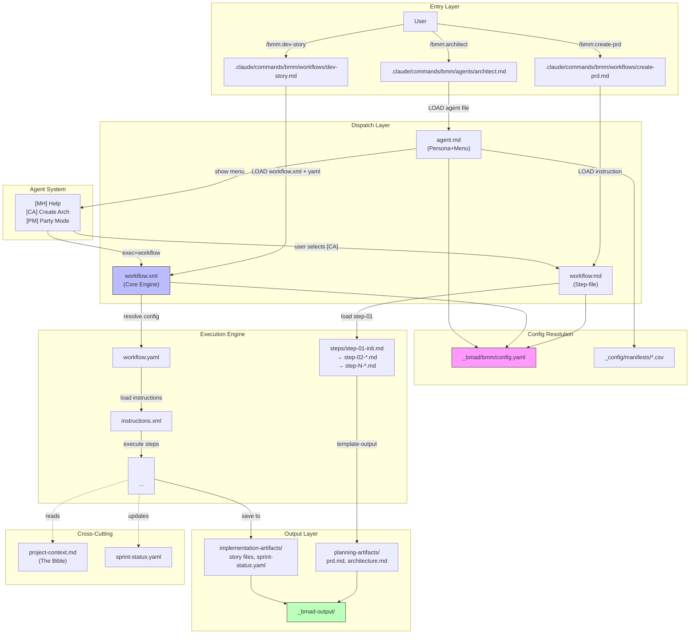

# BMAD-in-Claude-Code Architecture Analysis

> Reverse-engineered analysis of BMAD v6.0.0-alpha.22 command architecture within Claude Code

---

## A) BMAD-in-Claude-Code Architecture (Narrative)

### Overview

BMAD (Business Methodology and Architecture Development) v6.0.0-alpha.22 is a **modular, prompt-based agent orchestration framework** designed for Claude Code. It implements "vibe coding" through a sophisticated layered architecture where:

1. **Commands (.claude/commands/)** act as thin entry points that redirect to underlying prompts
2. **Agents (_bmad/*/agents/)** are persona-based prompt files with XML-embedded activation protocols
3. **Workflows (_bmad/*/workflows/)** are multi-step execution recipes in YAML/Markdown
4. **Tasks (_bmad/core/tasks/)** are reusable XML execution engines (most importantly `workflow.xml`)
5. **Manifests (_bmad/_config/)** serve as registries for discovery and routing

**Dispatch Model**: BMAD uses a **config-driven, load-on-demand** architecture. There is no centralized dispatcher code—instead, each command file contains inline instructions telling Claude to load and execute specific agent/workflow files. The "router" is literally the LLM itself, following embedded XML/Markdown directives.

**Key Design Pattern**: Commands are **indirection wrappers**—they don't contain logic, only paths. All logic lives in the workflow/agent files they reference.

### Directory Structure

```
_bmad/
├── _config/                          # Master configuration & manifest files
│   ├── manifest.yaml                 # Installation manifest (version 6.0.0-alpha.22)
│   ├── agent-manifest.csv            # Registry of all agents (16 total)
│   ├── workflow-manifest.csv         # Registry of all workflows (39 total)
│   ├── task-manifest.csv             # Registry of all tasks (6 total)
│   ├── agents/                       # Agent customization files (YAML)
│   └── ides/                         # IDE-specific config (claude-code.yaml)
│
├── _memory/                          # Persistent memory for agents
│
├── core/                             # Core BMAD platform module
│   ├── config.yaml                   # Core module configuration
│   ├── agents/
│   │   └── bmad-master.md            # Master orchestrator agent
│   ├── workflows/
│   │   ├── brainstorming/
│   │   ├── party-mode/               # Multi-agent discussion
│   │   └── advanced-elicitation/
│   └── tasks/                        # Core platform tasks (XML-based)
│       ├── workflow.xml              # THE CORE EXECUTION ENGINE
│       ├── validate-workflow.xml
│       ├── index-docs.xml
│       └── shard-doc.xml
│
├── bmm/                              # Business Methodology Module
│   ├── config.yaml
│   ├── agents/                       # 9 professional role agents
│   ├── workflows/
│   │   ├── 1-analysis/
│   │   ├── 2-plan-workflows/
│   │   ├── 3-solutioning/
│   │   ├── 4-implementation/
│   │   ├── bmad-quick-flow/
│   │   ├── testarch/
│   │   └── excalidraw-diagrams/
│   └── testarch/knowledge/           # 30+ test-related guides
│
└── cis/                              # Creative Innovation Suite module
    ├── agents/                       # 6 creative/strategic agents
    └── workflows/
```

### Modules Installed

| Module | Agents | Workflows | Purpose |
|--------|--------|-----------|---------|
| **core** | 1 (bmad-master) | 2 | Platform orchestration, execution engine |
| **bmm** | 9 | 30 | Business methodology (analysis → implementation) |
| **cis** | 6 | 4 | Creative innovation, brainstorming, storytelling |

---

## B) Command Taxonomy

### Command Entry Points

All commands live in `.claude/commands/bmm/` with two subdirectories:
- `workflows/` - 32 workflow commands
- `agents/` - 9 agent commands

### Complete Command Table

| Category | Command | Entry Point | Execution Target | Type |
|----------|---------|-------------|------------------|------|
| **Analysis** | `/bmm:create-product-brief` | `.claude/commands/bmm/workflows/create-product-brief.md` | `_bmad/bmm/workflows/1-analysis/create-product-brief/workflow.md` | Step-file workflow |
| **Analysis** | `/bmm:research` | `.claude/commands/bmm/workflows/research.md` | `_bmad/bmm/workflows/1-analysis/research/workflow.md` | Step-file workflow |
| **Planning** | `/bmm:create-prd` | `.claude/commands/bmm/workflows/create-prd.md` | `_bmad/bmm/workflows/2-plan-workflows/prd/workflow.md` | Step-file workflow |
| **Planning** | `/bmm:create-ux-design` | `.claude/commands/bmm/workflows/create-ux-design.md` | `_bmad/bmm/workflows/2-plan-workflows/create-ux-design/workflow.md` | Step-file workflow |
| **Solutioning** | `/bmm:create-architecture` | `.claude/commands/bmm/workflows/create-architecture.md` | `_bmad/bmm/workflows/3-solutioning/create-architecture/workflow.md` | Step-file workflow |
| **Solutioning** | `/bmm:create-epics-and-stories` | `.claude/commands/bmm/workflows/create-epics-and-stories.md` | `_bmad/bmm/workflows/3-solutioning/create-epics-and-stories/workflow.md` | Step-file workflow |
| **Solutioning** | `/bmm:check-implementation-readiness` | `.claude/commands/bmm/workflows/check-implementation-readiness.md` | `_bmad/bmm/workflows/3-solutioning/check-implementation-readiness/workflow.md` | Step-file workflow |
| **Implementation** | `/bmm:dev-story` | `.claude/commands/bmm/workflows/dev-story.md` | `_bmad/bmm/workflows/4-implementation/dev-story/workflow.yaml` | YAML+XML task |
| **Implementation** | `/bmm:code-review` | `.claude/commands/bmm/workflows/code-review.md` | `_bmad/bmm/workflows/4-implementation/code-review/workflow.yaml` | YAML+XML task |
| **Implementation** | `/bmm:sprint-planning` | `.claude/commands/bmm/workflows/sprint-planning.md` | `_bmad/bmm/workflows/4-implementation/sprint-planning/workflow.yaml` | YAML+XML task |
| **Implementation** | `/bmm:sprint-status` | `.claude/commands/bmm/workflows/sprint-status.md` | `_bmad/bmm/workflows/4-implementation/sprint-status/workflow.yaml` | YAML+XML task |
| **Implementation** | `/bmm:create-story` | `.claude/commands/bmm/workflows/create-story.md` | `_bmad/bmm/workflows/4-implementation/create-story/workflow.yaml` | YAML+XML task |
| **Implementation** | `/bmm:correct-course` | `.claude/commands/bmm/workflows/correct-course.md` | `_bmad/bmm/workflows/4-implementation/correct-course/workflow.yaml` | YAML+XML task |
| **Implementation** | `/bmm:retrospective` | `.claude/commands/bmm/workflows/retrospective.md` | `_bmad/bmm/workflows/4-implementation/retrospective/workflow.yaml` | YAML+XML task |
| **Quick Flow** | `/bmm:create-tech-spec` | `.claude/commands/bmm/workflows/create-tech-spec.md` | `_bmad/bmm/workflows/bmad-quick-flow/create-tech-spec/workflow.md` | Step-file workflow |
| **Quick Flow** | `/bmm:quick-dev` | `.claude/commands/bmm/workflows/quick-dev.md` | `_bmad/bmm/workflows/bmad-quick-flow/quick-dev/workflow.md` | Step-file workflow |
| **Test Arch** | `/bmm:testarch-framework` | `.claude/commands/bmm/workflows/testarch-framework.md` | `_bmad/bmm/workflows/testarch/framework/workflow.yaml` | YAML+XML task |
| **Test Arch** | `/bmm:testarch-atdd` | `.claude/commands/bmm/workflows/testarch-atdd.md` | `_bmad/bmm/workflows/testarch/atdd/workflow.yaml` | YAML+XML task |
| **Test Arch** | `/bmm:testarch-automate` | `.claude/commands/bmm/workflows/testarch-automate.md` | `_bmad/bmm/workflows/testarch/automate/workflow.yaml` | YAML+XML task |
| **Test Arch** | `/bmm:testarch-ci` | `.claude/commands/bmm/workflows/testarch-ci.md` | `_bmad/bmm/workflows/testarch/ci/workflow.yaml` | YAML+XML task |
| **Test Arch** | `/bmm:testarch-nfr` | `.claude/commands/bmm/workflows/testarch-nfr.md` | `_bmad/bmm/workflows/testarch/nfr-assess/workflow.yaml` | YAML+XML task |
| **Test Arch** | `/bmm:testarch-test-design` | `.claude/commands/bmm/workflows/testarch-test-design.md` | `_bmad/bmm/workflows/testarch/test-design/workflow.yaml` | YAML+XML task |
| **Test Arch** | `/bmm:testarch-test-review` | `.claude/commands/bmm/workflows/testarch-test-review.md` | `_bmad/bmm/workflows/testarch/test-review/workflow.yaml` | YAML+XML task |
| **Test Arch** | `/bmm:testarch-trace` | `.claude/commands/bmm/workflows/testarch-trace.md` | `_bmad/bmm/workflows/testarch/trace/workflow.yaml` | YAML+XML task |
| **Diagrams** | `/bmm:create-excalidraw-diagram` | `.claude/commands/bmm/workflows/create-excalidraw-diagram.md` | `_bmad/bmm/workflows/excalidraw-diagrams/create-diagram/workflow.yaml` | YAML task |
| **Diagrams** | `/bmm:create-excalidraw-dataflow` | `.claude/commands/bmm/workflows/create-excalidraw-dataflow.md` | `_bmad/bmm/workflows/excalidraw-diagrams/create-dataflow/workflow.yaml` | YAML task |
| **Diagrams** | `/bmm:create-excalidraw-flowchart` | `.claude/commands/bmm/workflows/create-excalidraw-flowchart.md` | `_bmad/bmm/workflows/excalidraw-diagrams/create-flowchart/workflow.yaml` | YAML task |
| **Diagrams** | `/bmm:create-excalidraw-wireframe` | `.claude/commands/bmm/workflows/create-excalidraw-wireframe.md` | `_bmad/bmm/workflows/excalidraw-diagrams/create-wireframe/workflow.yaml` | YAML task |
| **Documentation** | `/bmm:document-project` | `.claude/commands/bmm/workflows/document-project.md` | `_bmad/bmm/workflows/document-project/workflow.yaml` | YAML task |
| **Documentation** | `/bmm:generate-project-context` | `.claude/commands/bmm/workflows/generate-project-context.md` | `_bmad/bmm/workflows/generate-project-context/workflow.md` | Step-file workflow |
| **Status** | `/bmm:workflow-init` | `.claude/commands/bmm/workflows/workflow-init.md` | `_bmad/bmm/workflows/workflow-status/init/workflow.yaml` | YAML task |
| **Status** | `/bmm:workflow-status` | `.claude/commands/bmm/workflows/workflow-status.md` | `_bmad/bmm/workflows/workflow-status/workflow.yaml` | YAML task |
| **Agents** | `/bmm:analyst` | `.claude/commands/bmm/agents/analyst.md` | `_bmad/bmm/agents/analyst.md` | Agent activation |
| **Agents** | `/bmm:architect` | `.claude/commands/bmm/agents/architect.md` | `_bmad/bmm/agents/architect.md` | Agent activation |
| **Agents** | `/bmm:dev` | `.claude/commands/bmm/agents/dev.md` | `_bmad/bmm/agents/dev.md` | Agent activation |
| **Agents** | `/bmm:pm` | `.claude/commands/bmm/agents/pm.md` | `_bmad/bmm/agents/pm.md` | Agent activation |
| **Agents** | `/bmm:quick-flow-solo-dev` | `.claude/commands/bmm/agents/quick-flow-solo-dev.md` | `_bmad/bmm/agents/quick-flow-solo-dev.md` | Agent activation |
| **Agents** | `/bmm:sm` | `.claude/commands/bmm/agents/sm.md` | `_bmad/bmm/agents/sm.md` | Agent activation |
| **Agents** | `/bmm:tea` | `.claude/commands/bmm/agents/tea.md` | `_bmad/bmm/agents/tea.md` | Agent activation |
| **Agents** | `/bmm:tech-writer` | `.claude/commands/bmm/agents/tech-writer.md` | `_bmad/bmm/agents/tech-writer.md` | Agent activation |
| **Agents** | `/bmm:ux-designer` | `.claude/commands/bmm/agents/ux-designer.md` | `_bmad/bmm/agents/ux-designer.md` | Agent activation |

### Naming Convention

- Format: `/module:action` (e.g., `/bmm:create-prd`)
- Workflows use kebab-case action names
- Agent commands match agent file names

### Discoverability Methods

| Method | Location | Notes |
|--------|----------|-------|
| **Primary** | Claude Code slash command autocomplete | Types `/bmm:` to see available |
| **Secondary** | Agent menus (`[LW] List Workflows`) | Via bmad-master or any agent |
| **Tertiary** | CSV manifests | `workflow-manifest.csv`, `agent-manifest.csv` |
| **Missing** | No `--help` flag or built-in command discovery tool | Gap in UX |

---

## C) Execution Trace Examples

### Trace 1: `/bmm:create-prd` (Step-file Workflow)

```
User → /bmm:create-prd
  ↓
.claude/commands/bmm/workflows/create-prd.md
  │ Contains: "LOAD the FULL @_bmad/bmm/workflows/2-plan-workflows/prd/workflow.md"
  ↓
_bmad/bmm/workflows/2-plan-workflows/prd/workflow.md
  │ 1. Load config from _bmad/bmm/config.yaml
  │ 2. Resolve {user_name}, {output_folder}, {communication_language}
  │ 3. Load steps/step-01-init.md
  ↓
Sequential step file execution (step-01 → step-02 → ... → step-N)
  ↓
Output: {planning_artifacts}/prd.md
```

**Key Files:**
- Entry: `.claude/commands/bmm/workflows/create-prd.md`
- Workflow: `_bmad/bmm/workflows/2-plan-workflows/prd/workflow.md`
- Steps: `_bmad/bmm/workflows/2-plan-workflows/prd/steps/step-*.md`

---

### Trace 2: `/bmm:dev-story` (YAML+XML Task)

```
User → /bmm:dev-story
  ↓
.claude/commands/bmm/workflows/dev-story.md
  │ Contains: "LOAD @_bmad/core/tasks/workflow.xml"
  │           "Pass workflow-config @_bmad/bmm/workflows/4-implementation/dev-story/workflow.yaml"
  ↓
_bmad/core/tasks/workflow.xml (Core Execution Engine)
  │ 1. Load workflow.yaml and resolve config_source variables
  │ 2. Load instructions.xml
  │ 3. Execute <step n="1">, <step n="2">, etc.
  ↓
_bmad/bmm/workflows/4-implementation/dev-story/instructions.xml
  │ 10-step implementation cycle with sprint-status integration
  ↓
Outputs: Story file updates, sprint-status.yaml updates
```

**Key Files:**
- Entry: `.claude/commands/bmm/workflows/dev-story.md`
- Engine: `_bmad/core/tasks/workflow.xml`
- Config: `_bmad/bmm/workflows/4-implementation/dev-story/workflow.yaml`
- Instructions: `_bmad/bmm/workflows/4-implementation/dev-story/instructions.xml`

---

### Trace 3: `/bmm:architect` (Agent Activation)

```
User → /bmm:architect
  ↓
.claude/commands/bmm/agents/architect.md
  │ Contains: "LOAD @_bmad/bmm/agents/architect.md"
  ↓
_bmad/bmm/agents/architect.md
  │ <activation critical="MANDATORY">
  │   Step 1: Load persona
  │   Step 2: Load _bmad/bmm/config.yaml
  │   Step 3-7: Greet user, show menu
  │   Step 7+: Menu handler routing
  ↓
Interactive menu system with commands:
  [MH] Redisplay Menu Help
  [CH] Chat with the Agent
  [WS] Get workflow status
  [CA] Create an Architecture Document → exec=create-architecture/workflow.md
  [IR] Implementation Readiness Review → exec=check-implementation-readiness/workflow.md
  [PM] Start Party Mode → exec=party-mode/workflow.md
  [DA] Dismiss Agent
```

**Menu Handler Types:**
- `workflow="path"` → Load workflow.xml + pass YAML config
- `exec="path"` → Load and execute file directly
- `action="text"` → Execute inline instruction

---

### Trace 4: `/bmm:code-review` (YAML Task with Input Patterns)

```
User → /bmm:code-review
  ↓
.claude/commands/bmm/workflows/code-review.md → workflow.xml → workflow.yaml
  ↓
workflow.yaml contains input_file_patterns:
  │ architecture: FULL_LOAD → {planning_artifacts}/*architecture*/*.md
  │ ux_design: FULL_LOAD → {planning_artifacts}/*ux*/*.md
  │ epics: SELECTIVE_LOAD → specific epic based on {{epic_num}}
  ↓
_bmad/core/tasks/workflow.xml invokes discover_inputs protocol
  ↓
instructions.xml: Adversarial review with 3-10 mandatory findings
  ↓
Outputs: Senior Developer Review section added to story file
```

**Load Strategies:**
- `FULL_LOAD` - Load ALL files in sharded directory
- `SELECTIVE_LOAD` - Load specific shard using template variable
- `INDEX_GUIDED` - Load index.md, analyze, load relevant docs

---

### Trace 5: `/bmm:create-architecture` (Step-file with Data Files)

```
User → /bmm:create-architecture
  ↓
.claude/commands/bmm/workflows/create-architecture.md
  ↓
_bmad/bmm/workflows/3-solutioning/create-architecture/workflow.md
  │ installed_path = {project-root}/_bmad/bmm/workflows/3-solutioning/architecture
  │ template_path = {installed_path}/architecture-decision-template.md
  │ data_files_path = {installed_path}/data/
  ↓
steps/step-01-init.md → ... → step-N
  ↓
Output: {planning_artifacts}/architecture.md
```

---

### Trace 6: Party Mode (Multi-Agent Orchestration)

```
User → (via agent menu or directly)
  ↓
_bmad/core/workflows/party-mode/workflow.md
  │ Load _bmad/_config/agent-manifest.csv
  │ Parse 16 agents with full persona data
  ↓
steps/step-02-discussion-orchestration.md
  │ Agent selection based on topic relevance
  │ 2-3 agents respond per user message
  │ Character consistency via merged personality
  ↓
Interactive conversation until exit trigger (*exit, goodbye, end party, quit)
```

**Party Mode Features:**
- Loads all agent personas from manifest
- Selects 2-3 relevant agents per topic
- Maintains character consistency
- Enables agent-to-agent interactions
- Optional TTS integration

---

### Trace 7: `/bmm:sprint-planning` (Status Tracking)

```
User → /bmm:sprint-planning
  ↓
workflow.xml → workflow.yaml
  │ config: implementation_artifacts, sprint_status path
  ↓
instructions.xml
  │ Parse epics files
  │ Generate sprint-status.yaml with story status tracking
  ↓
Output: {implementation_artifacts}/sprint-status.yaml
```

**Sprint Status States:**
- `ready-for-dev` - Story ready for development
- `in-progress` - Currently being implemented
- `review` - Ready for code review
- `done` - Completed

---

### Trace 8: `/bmm:testarch-framework` (Test Architecture)

```
User → /bmm:testarch-framework
  ↓
workflow.yaml
  │ config: tea_use_playwright_utils, tea_use_mcp_enhancements
  │ Load testarch/knowledge/*.md guides
  ↓
Framework scaffolding based on project type (Playwright/Cypress)
```

**Test Architecture Workflows:**
- `testarch-framework` - Initialize test framework
- `testarch-atdd` - Acceptance test-driven development
- `testarch-automate` - Expand automation coverage
- `testarch-ci` - CI/CD quality pipeline
- `testarch-nfr` - Non-functional requirements
- `testarch-test-design` - Test planning
- `testarch-test-review` - Test quality review
- `testarch-trace` - Requirements traceability

---

### Trace 9: `/bmm:generate-project-context` (Documentation)

```
User → /bmm:generate-project-context
  ↓
workflow.md
  │ Scan codebase structure
  │ Extract patterns, coding standards
  ↓
Output: **/project-context.md (referenced by all agents as "the bible")
```

**Project Context Usage:**
- All agents check for `**/project-context.md`
- Treated as authoritative source for coding standards
- Informs implementation decisions across all workflows

---

### Trace 10: bmad-master Menu → List Workflows

```
User → (agent menu) [LW] List Workflows
  ↓
bmad-master.md <menu> item:
  │ action="list all workflows from {project-root}/_bmad/_config/workflow-manifest.csv"
  ↓
Parse CSV, display 39 workflows across 3 modules
```

**bmad-master Menu:**
- `[MH]` Redisplay Menu Help
- `[CH]` Chat with the Agent
- `[LT]` List Available Tasks
- `[LW]` List Workflows
- `[PM]` Start Party Mode
- `[DA]` Dismiss Agent

---

## D) Command Routing & Artifact Generation Diagram



### Execution Flow Summary

1. **User invokes** `/bmm:command` via Claude Code
2. **Command file** in `.claude/commands/` contains `LOAD` directive
3. **Two execution paths:**
   - **Step-file workflows** → Load `workflow.md` → Sequential step files
   - **YAML+XML tasks** → Load `workflow.xml` engine → Parse `workflow.yaml` → Execute `instructions.xml`
4. **Config resolution** from `_bmad/*/config.yaml`
5. **Outputs** written to `_bmad-output/` (planning-artifacts or implementation-artifacts)

---

## E) Transferable Patterns for Astragentic

### Patterns to Adopt

| Pattern | BMAD Implementation | Astragentic Application |
|---------|---------------------|-------------------------|
| **Thin command wrappers** | Commands contain only `LOAD @path` directives, no logic | Keep `.claude/commands/astra/` as pure pointers to `_astraler/workflows/` |
| **Config-as-runtime-dependency** | All workflows load `config.yaml` at step 1 | Centralize project settings in `_astraler/config.yaml`, resolve at workflow start |
| **Step-file architecture** | Complex workflows broken into `steps/step-01-*.md` files | Use for multi-phase workflows (spec → arch → task) |
| **XML execution engine** | `workflow.xml` is a reusable task runner | Create `_astraler/engine.md` as your execution kernel |
| **Manifest registries** | CSV files for agents, workflows, tasks | Use `_astraler/manifests/` for discoverability |
| **Input file patterns** | `input_file_patterns` with load strategies (FULL_LOAD, SELECTIVE_LOAD, INDEX_GUIDED) | Formalize context loading for change-gated workflows |
| **Agent menus** | Agents present numbered options, fuzzy match on input | Useful for exploratory entry points |
| **Sprint status tracking** | `sprint-status.yaml` as single source of truth | Map to `.astraler-docs/04-tasks/sprints/` |
| **Project context file** | `project-context.md` referenced by all agents | Establish equivalent in `.astraler-docs/01-context/` |
| **Template-output checkpoints** | Save after each section, ask user to continue | Prevents losing work, enables iterative refinement |

### Anti-Patterns to Avoid

| Anti-Pattern | BMAD Symptom | Astragentic Prevention |
|--------------|--------------|------------------------|
| **Deep nesting = lost seniors** | 4-level path: `.claude/commands/bmm/workflows/X.md` → `_bmad/bmm/workflows/phase/X/workflow.yaml` → `instructions.xml` | Flatten: `.claude/commands/astra/X.md` → `_astraler/workflows/X/` |
| **Hidden entry points** | Core workflows (brainstorming, party-mode) only in `core` module, not in `.claude/commands/` | Expose ALL user-invocable workflows in commands |
| **Phase coupling confusion** | "Which command for my current phase?" (1-analysis vs 4-implementation) | Add `/astra:where-am-i` that reads `.astraler-docs/` and suggests next command |
| **No command help** | No `--help`, `--list`, or discovery mechanism | Add `/astra:help` that lists commands with descriptions |
| **Overlapping agent menus** | Each agent has its own menu → same workflow accessible N ways | Single canonical entry per workflow, agents are personas not routers |
| **Implicit YOLO mode** | User must discover `[y] YOLO` option during execution | Make batch/interactive choice upfront with `/astra:X --auto` |
| **Project context dependency** | All agents look for `**/project-context.md` with different fallbacks | Standardize: Astragentic always generates context at init |

### Senior-Level Friction Points

#### 1. "Where do I start?"

**BMAD Problem:** No obvious entry point; must know to use `/bmm:workflow-init` or call an agent.

**Astragentic Fix:** Add `/astra:init` that:
- Bootstraps `.astraler-docs/` structure
- Creates `_index.md` navigation
- Prints "Next steps" based on project type (greenfield/brownfield)

#### 2. "Which command for this phase?"

**BMAD Problem:** Phase numbers (1-analysis, 2-plan, 3-solutioning, 4-implementation) in paths but not exposed to user.

**Astragentic Fix:**
- Surface phase in command help output
- `/astra:status` shows current phase and available commands
- Commands grouped by phase in help output

#### 3. "What did I already do?"

**BMAD Problem:** Must read `sprint-status.yaml` or agent menus.

**Astragentic Fix:** `/astra:status` reads `.astraler-docs/_index.md` and:
- Lists completed artifacts with dates
- Shows pending items
- Suggests next action

#### 4. "How do commands relate?"

**BMAD Problem:** No dependency graph; user must infer from phase numbers.

**Astragentic Fix:**
- `/astra:help --graph` shows workflow dependencies
- Commands reference prerequisites in their descriptions

#### 5. "Too many choices"

**BMAD Problem:** 41 commands across workflows and agents.

**Astragentic Fix:**
- Group into 3-5 "tracks" (greenfield, brownfield, change)
- Default happy path per track
- `/astra:quick` for streamlined single-command flow

---

## Key Insights

### What BMAD Does Well

1. **Clean separation of concerns** - Commands → Workflows → Outputs are distinct layers
2. **Powerful execution engine** - `workflow.xml` is a sophisticated task runner with:
   - Variable resolution
   - Step sequencing
   - Input file discovery
   - Template-output checkpoints
   - YOLO mode for batch execution
3. **Rich agent personas** - Consistent activation protocols with XML-embedded instructions
4. **Manifest-based discovery** - CSV registries enable programmatic introspection
5. **Sprint tracking** - `sprint-status.yaml` provides clear state management

### What BMAD Does Poorly

1. **Discoverability is poor** - No help system, no command listing
2. **Path depth causes cognitive overload** - 4+ levels of indirection
3. **Phase-based organization is invisible** - Numbers in paths (1-, 2-, 3-, 4-) not exposed to user
4. **Duplicate entry points** - Same workflow accessible via command AND agent menu
5. **No onboarding flow** - Assumes user knows where to start

### Architecture Decision

BMAD chose **LLM-as-dispatcher** over code-based routing. This means:
- No runtime to maintain
- Commands are just prompt files
- Routing logic is embedded in natural language instructions
- Tradeoff: Harder to debug, dependent on LLM following instructions

---

## File Reference

### Key Files for Understanding BMAD

| File | Purpose |
|------|---------|
| `_bmad/_config/manifest.yaml` | Installation info, version, modules |
| `_bmad/_config/agent-manifest.csv` | All agent definitions |
| `_bmad/_config/workflow-manifest.csv` | All workflow definitions |
| `_bmad/core/tasks/workflow.xml` | Core execution engine |
| `_bmad/bmm/config.yaml` | BMM module configuration |
| `_bmad/core/agents/bmad-master.md` | Master orchestrator agent |
| `.claude/commands/bmm/workflows/*.md` | Command entry points |

### Output Directories

| Directory | Contents |
|-----------|----------|
| `_bmad-output/planning-artifacts/` | PRD, architecture, UX design, epics |
| `_bmad-output/implementation-artifacts/` | Story files, sprint-status.yaml |
