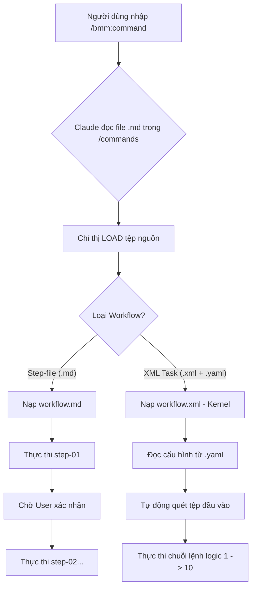

# Chi tiết Cơ chế Lệnh và Thực thi trong BMAD (Command & Execution Logic)

> Tài liệu này đi sâu vào cách BMAD kết nối giữa câu lệnh người dùng (Slash Commands) và các động cơ thực thi bên dưới.

---

## 1. Kiến trúc Tách biệt (Decoupled Architecture)

BMAD áp dụng mô hình thiết kế tách biệt hoàn toàn giữa **Giao diện (Frontend - Commands)** và **Logic (Backend - Workflows)**.

- **Commands** (`.claude/commands/`): Là những gì người dùng nhìn thấy và gõ vào terminal.
- **Workflows** (`_bmad/`): Là nơi chứa trí tuệ, quy trình và các bước thực hiện chi tiết.

Cầu nối giữa hai thành phần này là các chỉ thị **LOAD** và **READ** cực kỳ mạnh mẽ, ép LLM (Claude) phải thay đổi ngữ cảnh làm việc ngay lập tức.

---

## 2. Cấu trúc của một Câu lệnh (Anatomy of a Command)

Mọi file lệnh trong `.claude/commands/bmm/workflows/` đều tuân theo một cấu trúc tối giản nhưng hiệu quả.

**Ví dụ nội dung file `create-prd.md`:**
```markdown
---
description: 'Mô tả ngắn gọn về lệnh'
---
IT IS CRITICAL: 
1. LOAD the FULL @_bmad/path/to/workflow.md
2. READ its entire contents
3. FOLLOW its directions exactly!
```

**Tại sao lại làm vậy?**
1. **Tiết kiệm Token**: Claude không cần giữ toàn bộ quy trình trong bộ nhớ cho đến khi lệnh được gọi.
2. **Cập nhật dễ dàng**: Khi quy trình thay đổi, bạn chỉ cần sửa file ở `_bmad/`, hàng chục câu lệnh gọi nó sẽ tự động cập nhật theo.
3. **Ép buộc kỷ luật**: Việc sử dụng các từ mạnh như "CRITICAL", "MANDATORY" giúp AI tuân thủ quy trình tốt hơn.

---

## 3. Hai loại Động cơ Thực thi Chính

BMAD phân loại cách AI hành động thành hai "chế độ" khác nhau:

### Chế độ A: Quy trình Tệp-bước (Step-file Workflow)
Dành cho công việc **Thiết kế & Tư duy**.
- **Cấu trúc**: Một tệp `workflow.md` chính điều phối nhiều tệp `steps/step-XX-*.md`.
- **Đặc điểm**:
    - AI thực hiện nhiệm vụ như một cuộc hội thoại có hướng dẫn.
    - Sau mỗi bước, AI sẽ dừng lại để hỏi ý kiến người dùng hoặc yêu cầu xác nhận.
    - Phù hợp cho: PRD, Architecture, UX Design.

### Chế độ B: Nhiệm vụ XML (XML Task Engine - `workflow.xml`)
Dành cho công việc **Kỹ thuật & Tự động hóa**.
- **Cấu trúc**: Sử dụng tệp `workflow.xml` (được coi là Kernel/Hệ điều hành) nạp cấu hình từ `workflow.yaml`.
- **Đặc điểm**:
    - Thực thi chính xác như một chương trình máy tính.
    - Có khả năng quét file (Input Discovery), quản lý biến môi trường.
    - Có chế độ **YOLO mode**: AI tự thực hiện các bước mà không cần hỏi nếu người dùng cho phép.
    - Phù hợp cho: `dev-story`, `code-review`, `test-automation`.

---

## 4. Sơ đồ Luồng Thực thi Lệnh (Execution Flow)



---

## 5. Danh mục Tra cứu Lệnh Thực thi (Command Reference)

Dưới đây là cách các lệnh quan trọng nhất ánh xạ vào các tệp thực thi bên dưới:

| Câu lệnh Slash | Tệp thực thi (Target) | Loại động cơ |
| :--- | :--- | :--- |
| `/bmm:workflow-init` | `workflow-status/init/workflow.yaml` | XML Task |
| `/bmm:document-project` | `document-project/workflow.yaml` | XML Task |
| `/bmm:create-prd` | `2-plan-workflows/prd/workflow.md` | Step-file |
| `/bmm:create-architecture` | `3-solutioning/create-architecture/workflow.md` | Step-file |
| `/bmm:dev-story` | `4-implementation/dev-story/workflow.yaml` | XML Task |
| `/bmm:code-review` | `4-implementation/code-review/workflow.yaml` | XML Task |

---

## 6. Bài học Vận hành cho Kỹ sư (Developer Notes)

1. **Đừng bao giờ bỏ qua bước `init`**: Hệ thống cần tệp `bmm-workflow-status.yaml` để làm "neo" giữ các biến môi trường.
2. **Context là Vua**: Mọi lệnh thực thi code (`dev-story`) đều tìm kiếm tệp `project-context.md`. Nếu không có tệp này, tỷ lệ code lỗi sẽ tăng cao.
3. **Sức mạnh của `workflow.xml`**: Đây là thành phần mạnh mẽ nhất của BMAD, nó biến Claude từ một chatbot thành một "Worker" thực thụ có thể chạy các nhiệm vụ lặp đi lặp lại một cách hoàn hảo.
