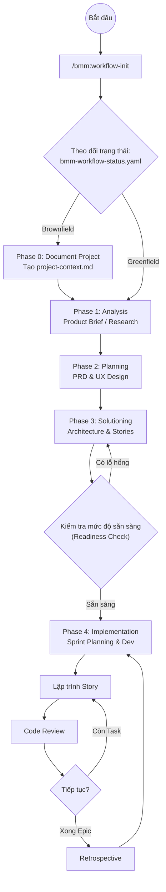

# Hướng dẫn Chuyên sâu về Quy trình BMAD (BMad Method Deep Dive)

> Tài liệu tổng hợp toàn bộ quy trình vận hành, giai đoạn phát triển và hệ thống tài liệu trong khung sản xuất phần mềm BMAD v6.0.0.

---

## 1. Triết lý Vận hành: Kỷ luật Thép cho AI

BMAD không hoạt động như một chatbot thông thường. Nó ép AI tuân thủ một quy trình kỹ thuật nghiêm ngặt thông qua:
- **Micro-file Architecture**: Chia nhỏ hướng dẫn thành từng bước (step files). AI chỉ được đọc 1 bước tại một thời điểm để tránh hiện tượng "quên" (lost in the middle).
- **State Tracking**: Theo dõi trạng thái dự án liên tục qua tệp `bmm-workflow-status.yaml`.
- **Adversarial Review**: Cơ chế "phản biện đối kháng" – một Agent đóng vai trò kiểm soát chất lượng sẽ tìm lỗi trong kế hoạch của Agent khác trước khi cho phép lập trình.

---

## 2. Phân loại Dự án: Greenfield vs. Brownfield

BMAD phân hóa quy trình cực kỳ rõ ràng dựa trên trạng thái hiện tại của mã nguồn.

### A. Greenfield (Dự án mới từ đầu)
**Trọng tâm**: Định hình tầm nhìn và thiết lập tiêu chuẩn.
- Bắt đầu từ con số 0.
- Ưu tiên các quy trình sáng tạo: Brainstorming -> Product Brief -> PRD.
- Thiết lập "vùng an toàn" cho AI thông qua tài liệu kiến trúc mới hoàn toàn.

### B. Brownfield (Dự án đã có mã nguồn)
**Trọng tâm**: Thấu hiểu và Thích ứng (Understand & Adapt).
- **Phase 0 (Bắt buộc)**: Chạy lệnh `/bmm:document-project`.
- Tạo `project-context.md`: Quét code cũ để dạy AI về các coding patterns, thư viện đang dùng và nợ kỹ thuật.
- Mọi kế hoạch mới phải chứng minh tính tương thích với hệ thống hiện tại.

---

## 3. Hành trình Người dùng (The User Journey)

Toàn bộ quá trình từ ý tưởng đến sản phẩm chạy được trải qua 5 giai đoạn cốt lõi (Phases):

### Giai đoạn 0: Tài liệu hóa (Chỉ dành cho Brownfield)
- **Hoạt động**: Quét codebase.
- **Tài liệu**: `project-context.md`.

### Giai đoạn 1: Phân tích (Analysis - Tùy chọn)
- **Hoạt động**: Nghiên cứu thị trường, đối thủ và động não ý tưởng.
- **Tài liệu**: `product-brief.md`, `research.md`.

### Giai đoạn 2: Lập kế hoạch (Planning - Bắt buộc)
- **Hoạt động**: Định nghĩa yêu cầu sản phẩm và thiết kế trải nghiệm người dùng.
- **Tài liệu**: `prd.md`, `ux-design.md`.

### Giai đoạn 3: Giải pháp (Solutioning - Bắt buộc)
- **Hoạt động**: Thiết kế kiến trúc kỹ thuật và chia nhỏ công việc.
- **Tài liệu**: `architecture.md`, `epics-and-stories.md`.
- **Chốt chặn**: Chạy lệnh `/bmm:check-implementation-readiness` để chuyển sang giai đoạn code.

### Giai đoạn 4: Triển khai (Implementation)
- **Hoạt động**: Lập kế hoạch Sprint, Lập trình, Review code và Họp rút kinh nghiệm.
- **Tài liệu**: `sprint-status.yaml`, `story-*.md`.

---

## 4. Sơ đồ Luồng hoạt động (Workflow Diagram)

---

## 5. Hệ thống Artifacts (Tài liệu đầu ra)

| Tên tài liệu | Giai đoạn | Vai trò của nó đối với AI |
| :--- | :--- | :--- |
| `bmm-workflow-status.yaml` | Toàn bộ | Bản đồ GPS: Giúp AI biết mình đang ở đâu và làm gì tiếp theo. |
| `project-context.md` | Phase 0/1 | Quy tắc ứng xử: Đảm bảo AI không viết code "lạ" so với dự án. |
| `prd.md` | Phase 2 | La bàn sản phẩm: Chỉ rõ mục tiêu kinh doanh và tính năng cần có. |
| `architecture.md` | Phase 3 | Bản thiết kế kỹ thuật: Quyết định cách dữ liệu chảy và cấu trúc thư mục. |
| `epics-and-stories.md` | Phase 3 | Kế hoạch thực thi: Chia việc thành các miếng nhỏ vừa miệng AI. |
| `sprint-status.yaml` | Phase 4 | Bảng điều khiển: Theo dõi tiến độ hoàn thành các Story. |

---

## 6. Các "Track" thực thi khác nhau

Bên cạnh quy trình chuẩn, BMAD còn có các biến thể:
1. **Quick Flow**: Bỏ qua các bước rườm rà, dùng cho việc sửa lỗi nhanh hoặc dự án siêu nhỏ. Đi thẳng từ **Tech-spec** -> **Code**.
2. **Enterprise Flow**: Thêm các tầng bảo mật, kiểm thử (Testing Architecture) và vận hành (DevOps).

---

## 7. Bài học cho Astragentic

Từ quy trình của BMAD, Astragentic có thể kế thừa:
1. **Cơ chế Gateway**: Luôn có một bước "Check Readiness" trước khi tốn token để code lung tung.
2. **Context-First**: Luôn nạp `project-context.md` trước khi thực hiện bất kỳ lệnh thay đổi mã nguồn nào.
3. **Yaml-driven development**: Sử dụng YAML để quản lý trạng thái, giúp cả người và máy đều dễ đọc.
