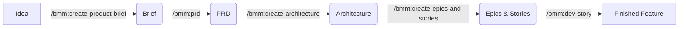

# Case Study 1: Phát triển Tính năng mới (Greenfield)

**Tình huống**: Bạn muốn xây dựng tính năng "Phân tích tâm lý bình luận video" (Sentiment Analysis) cho hệ thống của mình.

## Bước 1: Khám phá & Định nghĩa (Discovery)
Thay vì tự viết PRD, bạn hãy triệu hồi Trợ lý Phân tích.

**Lệnh**: `/bmm:create-product-brief`
- **Agent**: Mary (Analyst) sẽ xuất hiện.
- **Hành động**: Mary sẽ hỏi bạn về mục tiêu, đối tượng người dùng, và các tính năng cốt lõi.
- **Kết quả**: Một file `Product-Brief.md` chứa định hướng chung.

## Bước 2: Viết Spec chi tiết (PRD)
Bây giờ cần biến Brief thành yêu cầu kỹ thuật.

**Lệnh**: `/bmm:prd`
- **Agent**: PM (John) sẽ lấy file Brief làm context.
- **Hành động**: John xây dựng User Stories, Acceptance Criteria (AC), và chỉ rõ các ràng buộc.
- **Kết quả**: Thư mục `docs/prd/` với đầy đủ các file spec.

## Bước 3: Thiết kế Hệ thống (Architecture)
Trước khi code, phải biết dùng Tech stack nào.

**Lệnh**: `/bmm:create-architecture`
- **Agent**: Winston (Architect) sẽ đọc PRD.
- **Hành động**: Winston đề xuất mô hình (Ví dụ: dùng Python cho AI, Nodejs cho API), phân tích database schema.
- **Kết quả**: Tài liệu `Architecture.md` hoặc thư mục `docs/architecture/`.
- *Tham số*: Bạn có thể truyền file `requirements` khác nếu không muốn dùng `prd.md` mặc định.

## Bước 4: Chia nhỏ Task (Epics & Stories)
Đừng bắt AI code cả dự án một lúc. Hãy chia nhỏ nó.

**Lệnh**: `/bmm:create-epics-and-stories`
- **Kết quả**: Các tệp Epic (VD: `Epic-1-Backend-Integration.md`) chứa các User stories có thể thực hiện trong 1 ngày.

## Bước 5: Thực thi Code (Implementation)
Bắt đầu đổ móng và xây nhà.

**Lệnh**: `/bmm:dev-story`
- **Tham số nâng cao**:
    - `story_file`: Đường dẫn cụ thể (VD: `epics/epic-1/stories/story-1-login.md`) để bỏ qua bước chọn.
    - `yolo_mode`: `true` (Tự động thực thi không hỏi).
- **Hành động**: Agent Amelia (Dev) sẽ đọc Story số 1 -> Viết Test -> Viết Code -> Chạy Test.
- **Lưu ý**: Nếu bạn lười, hãy thêm `#yolo` vào lệnh để Amelia tự chạy hết các sub-task.

---

### Sơ đồ tóm tắt luồng Greenfield:

---
**Bài tiếp theo:** [Case Study 2: Làm chủ Dự án cũ (Brownfield)](./case-study-2-brownfield.md)
