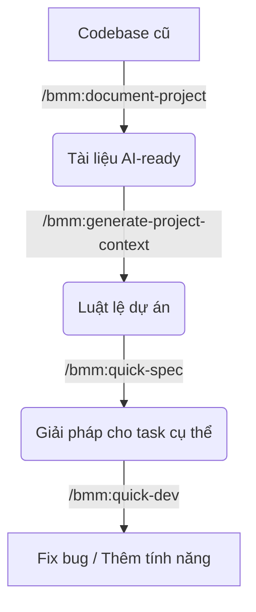

# Case Study 2: Làm chủ Dự án cũ (Brownfield)

**Tình huống**: Bạn vừa được bàn giao một codebase "khủng" (hàng chục nghìn dòng code) và không có một dòng tài liệu nào. Bạn cần sửa một bug hoặc thêm tính năng mà không làm hỏng logic cũ.

## Bước 1: Quét và Lập chỉ mục (Project Discovery)
Đừng đọc code bằng mắt, hãy để AI làm điều đó cho bạn một cách có hệ thống.

**Lệnh**: `/bmm:document-project`
- **Hành động**: Agent sẽ quét toàn bộ thư mục, nhận diện các library đang dùng, các pattern (MVC, Clean Architecture...), và vẽ ra sơ đồ tổng quan.
- **Kết quả**: Một thư mục `.astraler-docs/` chứa toàn bộ kiến thức về codebase hiện tại.

## Bước 2: Thiết lập "Luật chơi" (Project Context)
Để các Agent sau này không code sai pattern, bạn cần chốt lại các quy tắc.

**Lệnh**: `/bmm:generate-project-context`
- **Hành động**: AI tóm tắt những thứ quan trọng nhất từ Bước 1 vào một file duy nhất.
- **Kết quả**: File `project-context.md` ở root folder. 
- *Tham số nâng cao*: Nếu muốn tạo nhiều context khác nhau, bạn có thể đổi biến `context_file`.
- *Mẹo*: Hãy thêm các quy tắc cá nhân vào đây (VD: "Mọi biến phải viết bằng tiếng Việt" - nếu bạn muốn).

## Bước 3: Phân tích nhanh trước khi sửa (Quick Spec)
Giả sử bạn cần sửa lỗi Login.

**Lệnh**: `/bmm:quick-spec`
- **Tham số (Tùy chọn)**: Bạn có thể chỉ định `input_files` nếu biết chính xác file nào bị lỗi.
- **Hành động**: Bạn nói "Hãy phân tích tại sao login không hoạt động". AI sẽ tìm các tệp liên quan đến `auth`, `login`, `session`.
- **Kết quả**: Một bản Tech-spec ngắn gọn liệt kê các tệp cần sửa.

## Bước 4: Sửa lỗi an toàn (Quick Dev)
**Lệnh**: `/bmm:quick-dev`
- **Hành động**: AI thực hiện sửa đổi dựa trên Spec ở bước 3.
- **Mẹo**: Luôn bảo AI viết Unit Test cho đoạn code vừa sửa để đảm bảo không có regression bug.

---

### Sơ đồ tóm tắt luồng Brownfield:

---
**Bài tiếp theo:** [Case Study 3: Giải quyết bài toán Kinh doanh & Sáng tạo](./case-study-3-creative.md)
