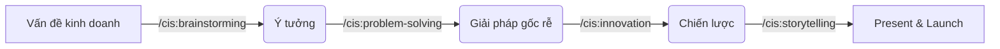

# Case Study 3: Giải quyết bài toán Kinh doanh & Sáng tạo

**Tình huống**: Bạn đang làm một ứng dụng nhưng nhận thấy người dùng không quay lại sau lần đầu sử dụng (Retention thấp). Bạn không biết lỗi ở code hay ở ý tưởng kinh doanh.

## Bước 1: Khởi động Buổi thảo luận (Brainstorming)
Cần những góc nhìn mới mẻ và điên rồ.

**Lệnh**: `/cis:brainstorming`
- **Agent**: Carson (Brainstorming Coach) sẽ dẫn dắt.
- **Hành động**: Carson áp dụng các kỹ thuật như "Reverse Brainstorming" (Làm thế nào để người dùng ghét ứng dụng hơn nữa?) để tìm ra các điểm yếu tiềm ẩn.

## Bước 2: Truy tìm Gốc rễ vấn đề (Problem Solving)
Sau khi có ý tưởng, cần hệ thống lại.

**Lệnh**: `/cis:problem-solving`
- **Agent**: Dr. Quinn (Creative Problem Solver).
- **Hành động**: Áp dụng kỹ thuật "5 Whys" hoặc "First Principles Thinking".
- **Kết quả**: Xác định được nguyên nhân cốt lõi (Ví dụ: UX quá phức tạp, không phải do thiếu tính năng).

## Bước 3: Tìm kiếm Chiến lược Đột phá (Innovation Strategy)
Làm thế nào để khác biệt so với thị trường?

**Lệnh**: `/cis:innovation-strategy`
- **Agent**: Victor (Innovation Strategist).
- **Hành động**: Phân tích "Blue Ocean Strategy" (Chiến lược đại dương xanh). Victor sẽ gợi ý bạn cắt bỏ những thứ thừa thãi và tập trung vào một giá trị cốt lõi duy nhất.

## Bước 4: Kể câu chuyện mới (Storytelling)
Bây giờ bạn cần thuyết phục sếp hoặc nhà đầu tư về thay đổi này.

**Lệnh**: `/cis:storytelling`
- **Agent**: Sophia (Storyteller).
- **Tham số**: `input_text` (Nội dung thô cần biên tập lại), `audience` (Đối tượng người nghe: Investor, User, Internal Team).
- **Hành động**: Giúp bạn xây dựng bản thuyết trình (Pitch Deck) theo cấu trúc "Hero's Journey" (Hành trình anh hùng).

---

### Tầm quan trọng của CIS:
Nhóm lệnh CIS giúp Technical Lead không chỉ là một "thợ code" mà trở thành một **Solution Architect** thực thụ, người giải quyết các bài toán ở tầng cao hơn logic của máy tính.

