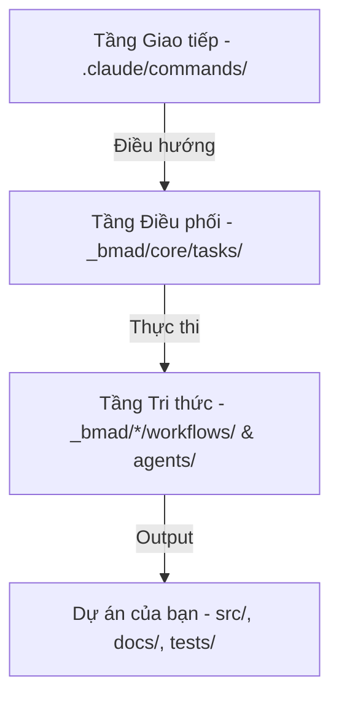

# Module 1: Cấu trúc và Tư duy BMAD (BMAD Mindset)

## 1. Triết lý "Workflow-First"
Trong lập trình truyền thống (Vibe Coding tự phát), bạn chat với AI và hy vọng nó làm đúng. Trong **BMAD**, chúng ta không chat, chúng ta **vận hành quy trình**.

### Sự khác biệt:
| Đặc điểm | Vibe Coding Tự phát | BMAD Method |
| :--- | :--- | :--- |
| **Trung tâm** | Chat Prompt | Workflow (Quy trình) |
| **Ngữ cảnh** | Dựa vào lịch sử chat | Dựa vào `project-context.md` và `manifest` |
| **Nhân sự** | 1 AI đa năng | Hệ thống Agent chuyên biệt (Analyst, Dev, Architect...) |
| **Kết quả** | Code chạy được | Code + Spec + Architecture + Test (Full Lifecycle) |

---

## 2. Kiến trúc phân tầng của BMAD

BMAD hoạt động dựa trên 3 tầng chính:

1.  **Entry Points (Lệnh Slash)**: Các file `.md` mỏng chứa lệnh `LOAD`. Ví dụ: `/bmm:prd`.
2.  **Execution Engine (`workflow.xml`)**: "Động cơ" đọc các bước truyền vào và ép Claude thực thi theo đúng thứ tự, không được nhảy cóc.
3.  **Module Domains**:
    -   **BMM (Business)**: Quy trình phần mềm từ Brief -> PRD -> Code -> Test.
    -   **CIS (Creative)**: Tư duy thiết kế, giải quyết vấn đề.
    -   **BMB (Builder)**: Tự xây dựng thêm Agent/Workflow cho riêng bạn.

---

## 3. Hệ thống Agent chuyên biệt (Personas)

Thay vì dùng một "Claude" chung chung, BMAD triệu hồi các "Persona" có kiến thức chuyên sâu:

-   **Mary (Analyst)**: Chuyên đi săn lùng requirement, phân tích đối thủ.
-   **Winston (Architect)**: Chuyên thiết kế hệ thống, lo về scalability và tech stack.
-   **Amelia (Dev)**: Chỉ code dựa trên Spec đã có, không tự tiện sửa logic.
-   **John (PM)**: Giữ cho dự án đi đúng hướng, ưu tiên giá trị người dùng.
-   **Murat (TEA - Test Architect)**: Đảm bảo chất lượng, viết test trước khi code.

---

## 4. Giao thức "Single Source of Truth" (SSOT)

BMAD cực kỳ coi trọng tệp `project-context.md`.
- Mọi Agent khi bắt đầu làm việc đều phải tìm và đọc tệp này.
- Đây là nơi chứa "Luật lệ" của dự án: Tech stack là gì? Cách đặt tên biến? Quy trình Git?
- Nếu không có file này, AI sẽ làm việc theo bản năng. BMAD giúp bạn tạo file này qua lệnh `/bmm:generate-project-context`.

---
**Bài học tiếp theo:** [Module 2: Từ điển Lệnh và Luồng thực thi](./module-2-commands.md)
