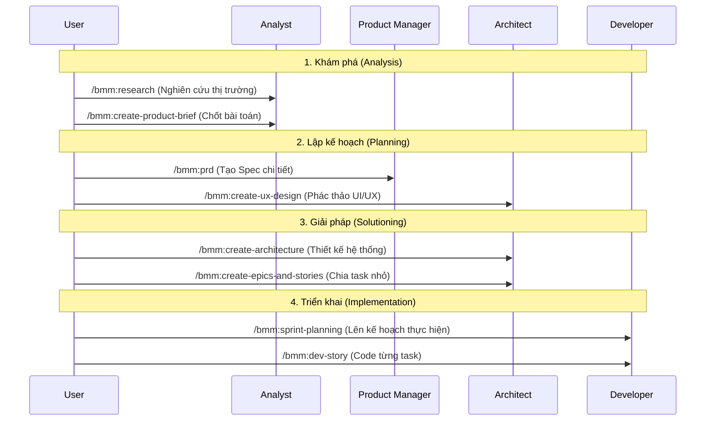

# Module 2: Từ điển Lệnh và Luồng thực thi

BMAD cung cấp hơn 40 câu lệnh, nhưng bạn không cần nhớ hết. Hãy phân loại chúng theo giai đoạn của dự án.

## 1. Bản đồ lộ trình (The Full Lifecycle Flow)

Dưới đây là luồng sử dụng lệnh chuẩn để phát triển một dự án từ đầu đến cuối:

---

## 2. Nhóm lệnh "Cứu trợ" (Quick Flows)

Khi bạn không muốn làm theo quy trình dài dòng, hãy dùng nhóm lệnh này:

-   **/bmm:quick-spec**: Bạn chat với AI, nó sẽ tự quét code và tạo ra một bản "Tech-spec" nhanh để code ngay.
-   **/bmm:quick-dev**: Code nhanh dựa trên spec hoặc chỉ dẫn trực tiếp.
-   **/bmm:document-project**: (Cực hay) Quét một dự án có sẵn và tự viết tài liệu hướng dẫn cho AI.

---

## 3. Nhóm lệnh "Kiểm soát chất lượng" (Quality Gates)

-   **/bmm:check-implementation-readiness**: Kiểm tra xem file PRD và Architecture đã đủ tốt để code chưa. Tránh tình trạng AI code giữa chừng thì lỗi vì thiếu logic.
-   **/bmm:code-review**: Đóng vai một Senior Dev "khó tính", soi từng dòng code và bắt lỗi security/performance.

---

## 4. Nhóm lệnh "Sáng tạo" (CIS - Creative Innovation)

Dùng khi bạn bị "bí" ý tưởng hoặc muốn đổi mới:

-   **/cis:brainstorming**: Mở một buổi thảo luận sáng tạo cực kỳ năng lượng.
-   **/cis:problem-solving**: Áp dụng các phương pháp như Root Cause Analysis để tìm ra gốc rễ vấn đề.
-   **/cis:storytelling**: Giúp bạn viết nội dung, pitch deck hoặc tài liệu hướng dẫn một cách cuốn hút hơn.

---

## 6. Tham khảo Tham số Nâng cao (Technical Parameters)

Hầu hết các lệnh BMAD hoạt động theo cơ chế **Hỏi-Đáp (Interactive)**, tức là Agent sẽ tự hỏi bạn những gì nó cần. Tuy nhiên, nếu muốn chuyên nghiệp, bạn có thể hiểu các "tham số ngầm" mà hệ thống sử dụng:

### Nhóm lệnh Dự án & Tài liệu
| Lệnh | Biến (Input Variable) | Giải thích |
| :--- | :--- | :--- |
| `/bmm:document-project` | `target_dir` | Thư mục cần quét (Mặc định: `.`) |
| `/bmm:generate-project-context` | `context_file` | Tên file đầu ra (Mặc định: `project-context.md`) |

### Nhóm lệnh Code & Review
| Lệnh | Biến (Input Variable) | Giải thích |
| :--- | :--- | :--- |
| `/bmm:dev-story` | `story_file` | Đường dẫn file Story cần code (VD: `stories/story-1.md`) |
| `/bmm:code-review` | `story_path` | File Story chứa yêu cầu (Acceptance Criteria) để đối chiếu |
| `/bmm:testarch-framework` | `framework_preference` | `playwright` hoặc `cypress` (Mặc định: `auto`) |

---

## 7. Mẹo thực thi: Chế độ #yolo vs Normal

Mọi workflow của BMAD đều hỏi bạn xác nhận ở mỗi bước quan trọng.
- **Normal mode**: Bạn kiểm soát từng bước (Khuyên dùng cho Architect/PM).
- **#yolo mode**: Bạn tin tưởng AI và để nó tự làm hết từ đầu đến cuối (Khuyên dùng cho các task nhỏ, boilerplate code).

---
**Bài thực hành:** [Case Study 1: Phát triển Tính năng mới](./case-study-1-greenfield.md)
